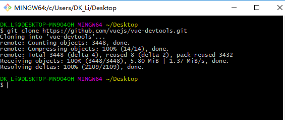
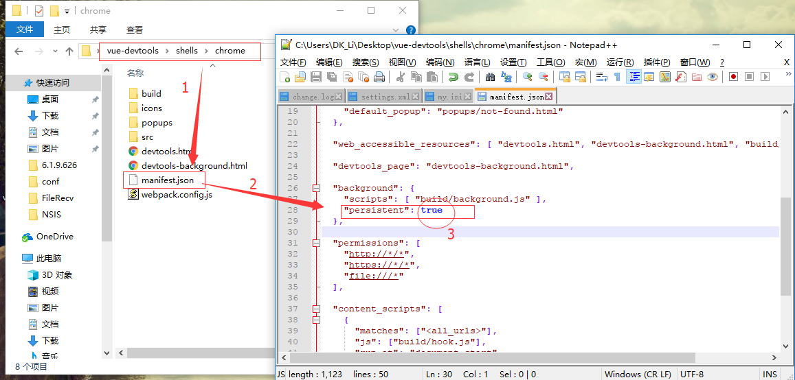
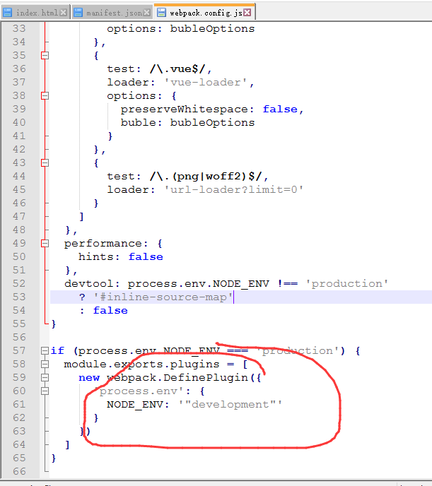

[](https://github.com/vuejs/vue-devtools#vue-devtools)

总操作流程：
- 1、[下载devtools源码](#vue.js-01)
- 2、[下载依赖，编译源程序](#vue.js-02)
- 3、[修改配置文件](#vue.js-03)
- 4、[将插件安装到浏览器](#vue.js-04)
- 5、[调整项目的webpack.config.js](#vue.js-05)

----------
# <a name="vue.js-01" href="#" >下载devtools源码</a>
[](https://github.com/vuejs/vue-devtools#vue-devtools)



# <a name="vue.js-02" href="#" >下载依赖，编译源程序</a>
```shell
cd C:\Users\DK_Li\Desktop\vue-devtools  #进入刚才下载的文件的文件夹里

cnpm install #下载依赖

cnpm run build #编译源程序
```
# <a name="vue.js-03" href="#" >修改配置文件</a>


# <a name="vue.js-04" href="#" >将插件安装到浏览器</a>


# <a name="vue.js-05" href="#" >调整项目的webpack.config.js</a>


```shell
development
```