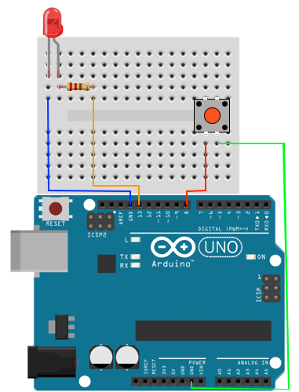
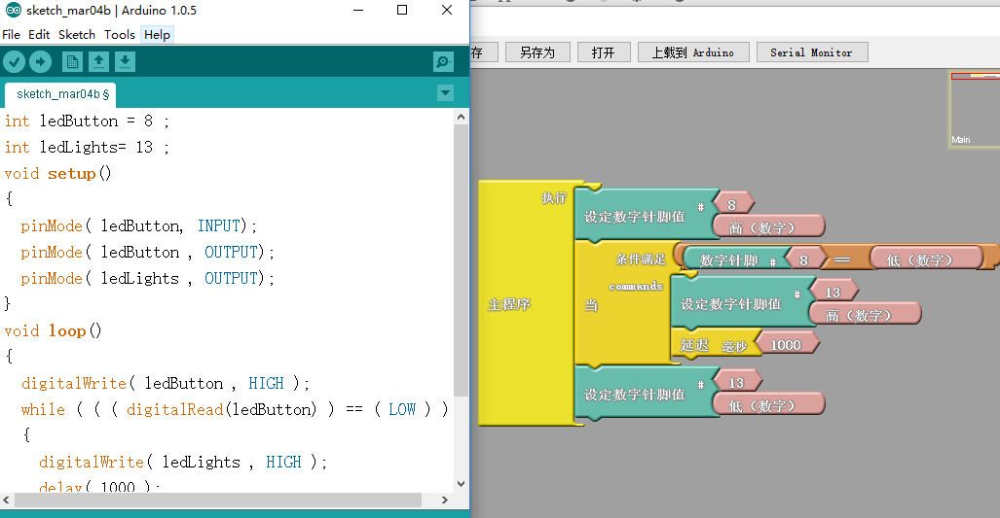
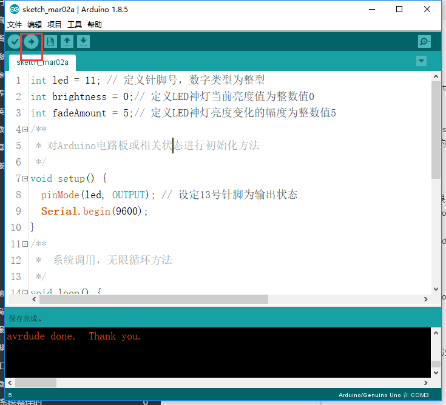

总操流程：
- 1、[各器件链接](#arduino-01)
- 2、[写入程序](#arduino-02)
- 3、[测试](#arduino-03)

----------
# <a name="arduino-01" href="#" >各器件链接</a>



# <a name="arduino-02" href="#" >写程序</a>

```c
int ledButton = 8 ;
int ledLights= 13 ;
void setup()
{
  pinMode( ledButton, INPUT);
  pinMode( ledButton , OUTPUT);
  pinMode( ledLights , OUTPUT);
}

void loop()
{
  digitalWrite( ledButton , HIGH );
  while ( ( ( digitalRead(ledButton) ) == ( LOW ) ) )
  {
    digitalWrite( ledLights , HIGH );
    delay( 1000 );
  }
  digitalWrite( ledLights , LOW );
}
```

### 另外一种方式（ardublock图形编程）



# <a name="arduino-03" href="#" >测试</a>

