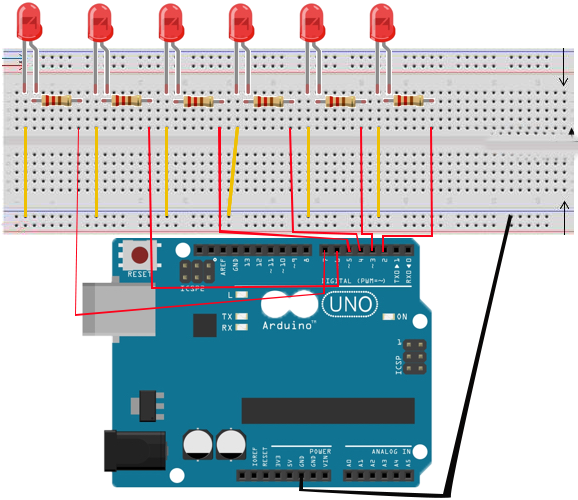
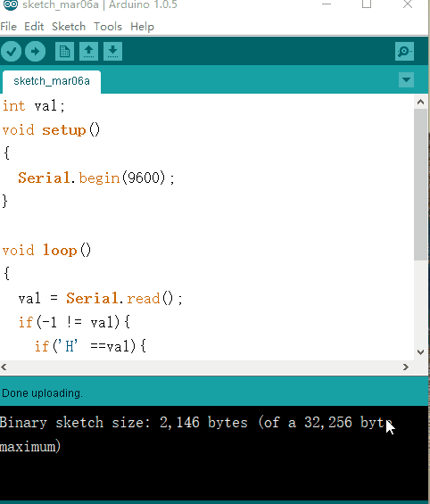

总操流程：
- 1、[各器件链接](#arduino-01)
- 2、[写入程序](#arduino-02)
- 3、[测试](#arduino-03)

----------
# <a name="arduino-01" href="#" >各器件链接</a>



# <a name="arduino-02" href="#" >写入程序</a>

<details>
<summary>代码</summary>

```c
int startPin = 2 ;
int endPin = 7 ;
int index = 0 ;

void setup()
{
  for(int i = startPin;i <= endPin;i++){
    pinMode(i,OUTPUT);
  }
}

void loop()
{
  for(int i = startPin;i <= endPin;i++){
   digitalWrite(i,LOW);
  }
  digitalWrite(startPin + index,HIGH);
  index = (index + 1) % (endPin -  startPin + 1);
  delay(100);
}
```

</details>

# <a name="arduino-03" href="#" >测试</a>
