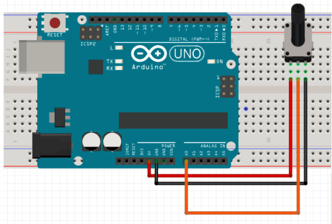
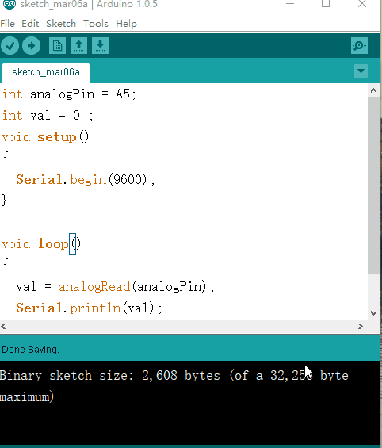

总操流程：
- 1、[各器件链接](#arduino-01)
- 2、[写入程序](#arduino-02)
- 3、[测试](#arduino-03)

----------
# <a name="arduino-01" href="#" >各器件链接</a>
链接各个器件


# <a name="arduino-02" href="#" >写程序</a>
```c
int analogPin = A0;
int val = 0 ;
void setup()
{
  Serial.begin(9600);
}

void loop()
{
  val = analogRead(analogPin);
  Serial.println(val);
  delay(1000);
}
```
# <a name="arduino-03" href="#" >测试</a>
`转动电位器可以看到数值变化`
