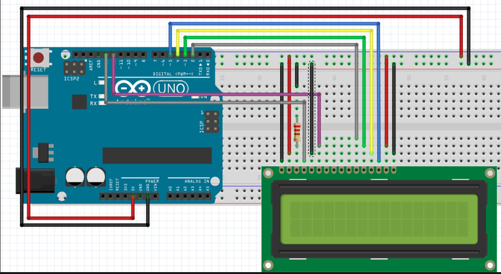
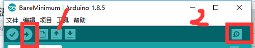

[](https://www.cnblogs.com/liujw2114/p/6011214.html)


总操流程：
- 1、[各器件链接](#arduino-01)
- 2、[写入程序](#arduino-02)
- 3、[测试](#arduino-03)

----------
# <a name="arduino-01" href="#" >各器件链接</a>
`LCD1602液晶引脚说明`

| pin | 名称 | 注释 |
| :-: | :-: | :-: |
| 1 | VSS| 电源地 |
| 2 | VDD | 电源正极 |
| 3 | VL | 液晶显示偏压信号 |
| 4 | RS | 数据/命令选择端（H/L） |
| 5 | R/S | 读/写选择端（H/L） |
| 6 | E | 使能信号 |
| 7 | DO | Data I/O |
| 8 | D1 | Data I/O |
| 9 | D2 | Data I/O |
| 10 | D3 | Data I/O |
| 11 | D4 | Data I/O |
| 12 | D5 | Data I/O |
| 13 | D6 | Data I/O |
| 14 | D7 | Data I/O |
| 15 | BLA | 背光源正极 |
| 4 | BLK | 背光源负极 |


# <a name="arduino-02" href="#" >写程序</a>

<details>
<summary>代码</summary>

```c
#include<LiquidCrystal.h>
LiquidCrystal lcd(13,12,2,3,4,5);
void setup(){
    lcd.begin(16,2);
}
void loop(){
    lcd.clear();
    /**
     * 温度
     */
    lcd.setCursor(0,0);
    lcd.print("Tem(");
    lcd.print((char)223);//显示o符号
    lcd.print("C):");
    lcd.setCursor(8,0);
    lcd.print(32.00);
    /**
     * 湿度
     */
    lcd.setCursor(0,1);
    lcd.print("Hum(");
    lcd.print((char)37);//显示%符号
    lcd.print("):");
    lcd.setCursor(7,1);
    lcd.print(32);

    /**
     * 天数
     */
    lcd.setCursor(10,1);
    lcd.print("Day:");
    lcd.setCursor(14,1);
    lcd.print(22);
    delay(5000);
}
```

</details>

# <a name="arduino-03" href="#" >测试</a>
