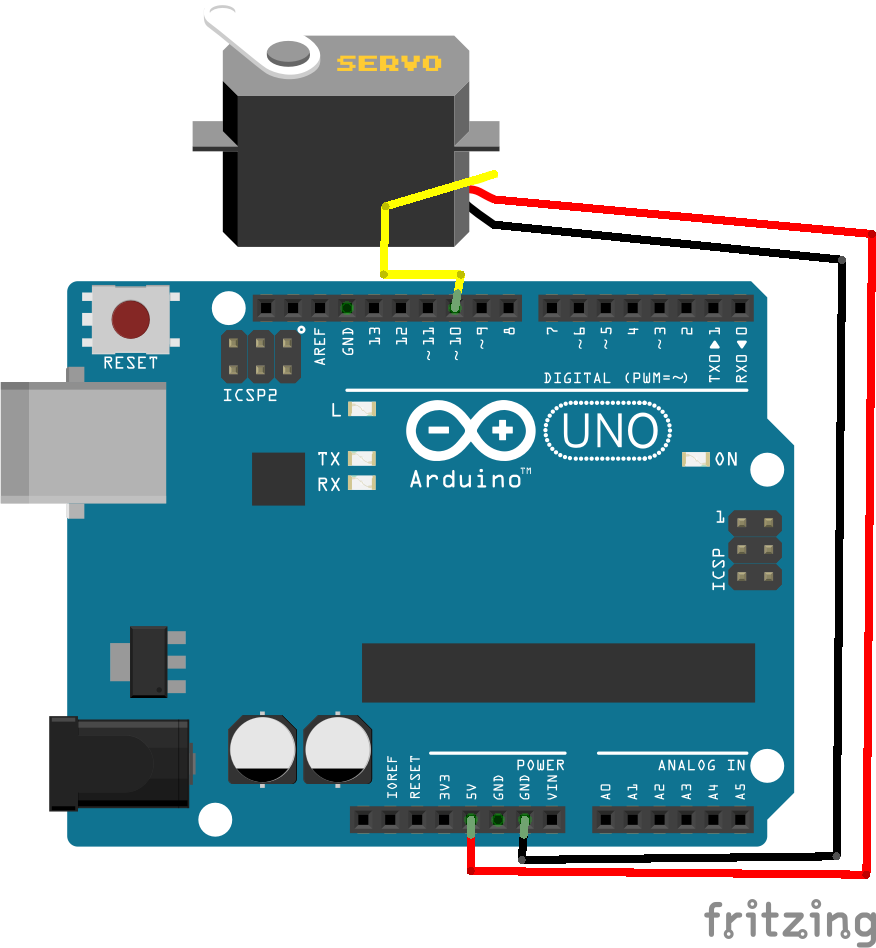
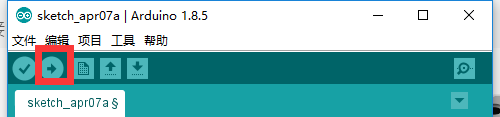

总操流程：
- 1、[各器件链接](#arduino-01)
- 2、[写入程序](#arduino-02)
- 3、[测试](#arduino-03)

----------
# <a name="arduino-01" href="#" >各器件链接</a>

# <a name="arduino-02" href="#" >写程序</a>
```c
#include <Servo.h>

#define PIN_SERVO 10
Servo myservo;

void setup()
{
  myservo.attach(PIN_SERVO);
}

void loop()
{
  /**
   * 角度范围是0°到180°
   */
  myservo.write(0);
  delay(1000);
  myservo.write(90);
  delay(1000);
}
```
# <a name="arduino-03" href="#" >测试</a>
