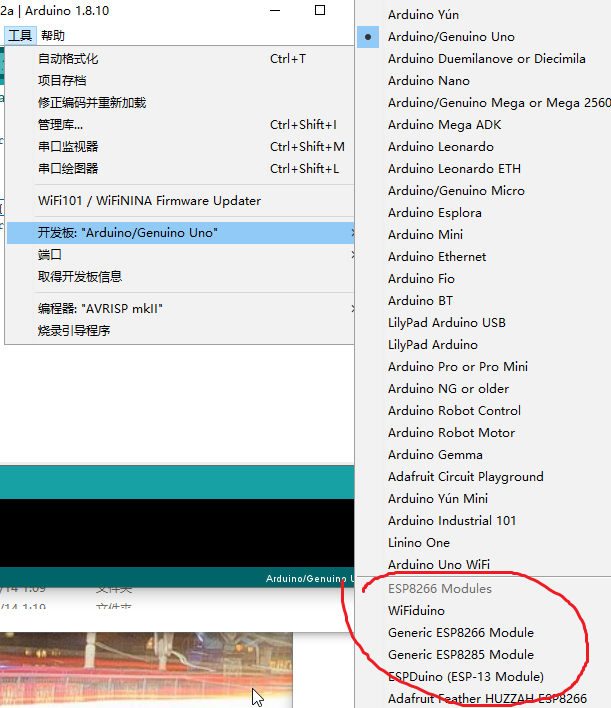
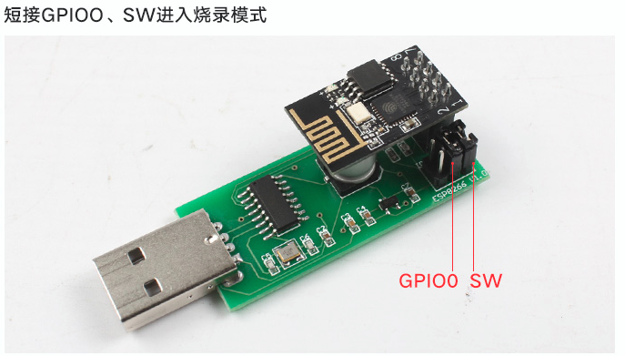
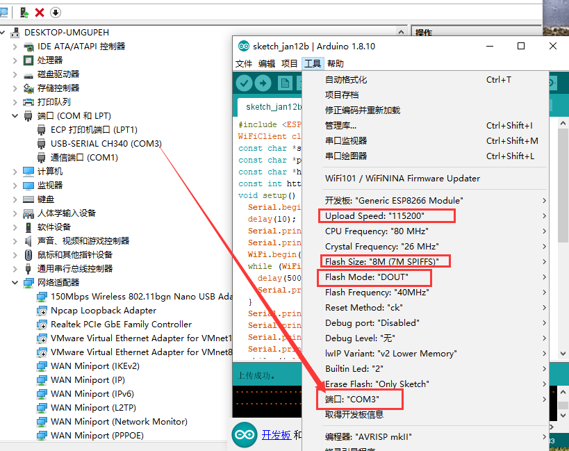
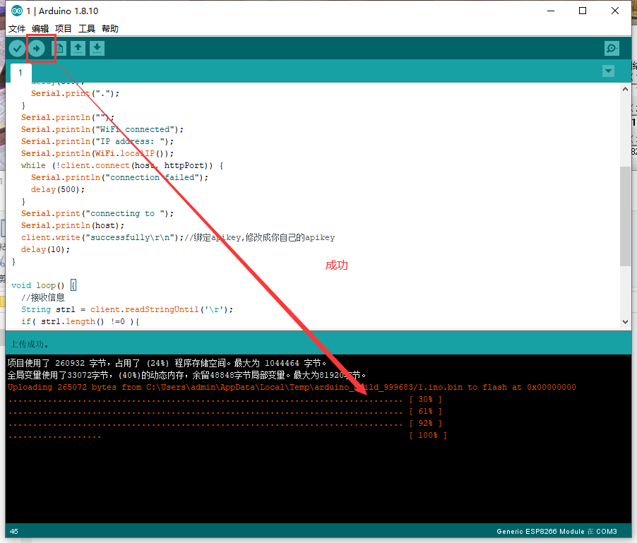
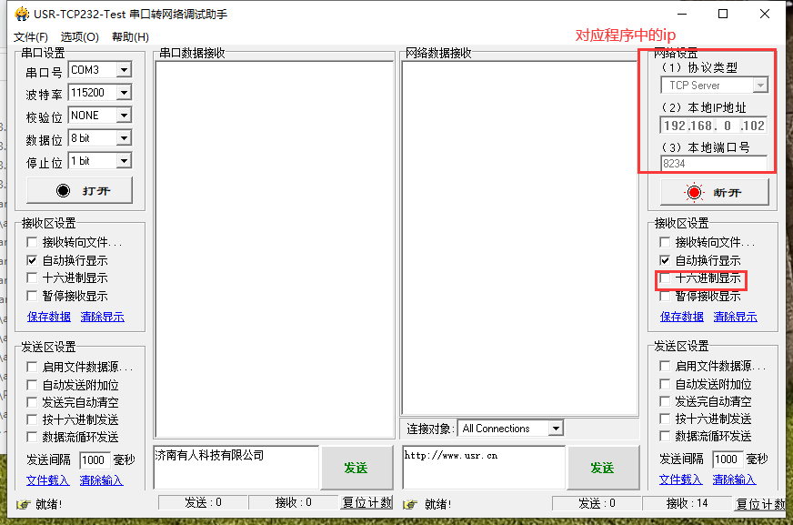
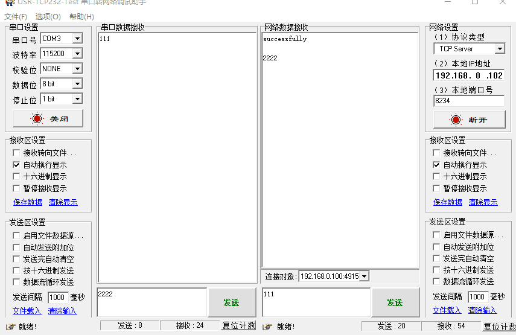

总操作流程：
- 1、[下安装](#ESP8266-01)
- 2、[烧写](#ESP8266-02)
- 3、[测试](#ESP8266-03)

***

# <a name="ESP8266-01" href="#" >下安装</a>

> 安装时路径不要改，这是对应arduino ide中的路径

[](https://pan.baidu.com/s/1ZAKDMQ9ojpurD2UM8BtwAA)

- 成功标识：



# <a name="ESP8266-02" href="#" >烧写</a>

> 各器件链接

- 使用usb转串口链接esp8266



> 烧写程序

- arduino id 配置



- 写程序

<details>
<summary>代码</summary>

```java
#include <ESP8266WiFi.h>
WiFiClient client;
const char *ssid     = "TP-LINK888";//要加入路由的wifi名
const char *password = "QwE@123@*~*";//要加入路由的wifi密码
const char *host = "192.168.0.102";//服务器IP
const int httpPort =8234;//服务器端口号
void setup() {
  Serial.begin(115200);
  delay(10);
  Serial.print("Connecting to ");
  Serial.println(ssid);
  WiFi.begin(ssid, password);
  while (WiFi.status() != WL_CONNECTED) {
    delay(500);
    Serial.print(".");
  }
  Serial.println("");
  Serial.println("WiFi connected");
  Serial.println("IP address: ");
  Serial.println(WiFi.localIP());
  while (!client.connect(host, httpPort)) {
    Serial.println("connection failed");
    delay(500);
  }
  Serial.print("connecting to ");
  Serial.println(host);
  client.write("successfully\r\n");//绑定apikey,修改成你自己的apikey
  delay(10);
}

void loop() {

  //接收信息
  while(client.available()){
    String line = client.readStringUntil('\r');
     Serial.println(line);
  }
  //发送信息
  while(Serial.available()){
    String line = Serial.readStringUntil('\r');
    client.println(line);
  }

}
```

</details>



- 烧写失败，拔出usb转串口重插


# <a name="ESP8266-03" href="#" >测试</a>

> 串口/网络助手调试

[](https://pan.baidu.com/s/1m5MAc4ZON0x-nsT-WQAr7g)

- 制作服务端 




> 各器件链接

- 使用usb转串口链接esp8266


- 串口助手调试

先开启服务端，再插入“usb转串口”




