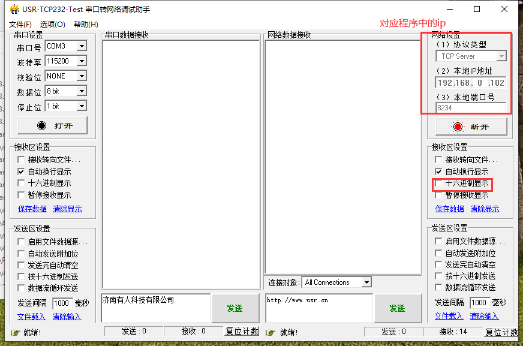
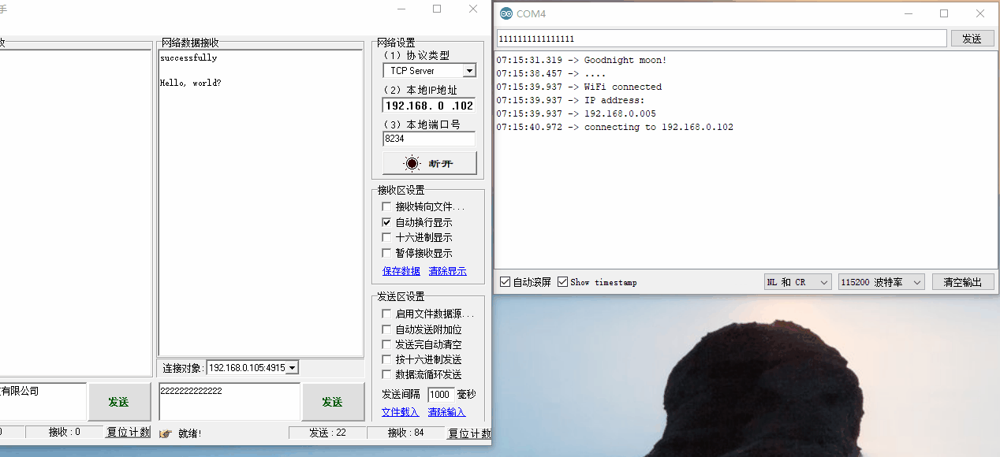

总操作流程：
- 1、[各器件链接](#ESP8266-01)
- 2、[写程序](#ESP8266-02)
- 3、[测试](#ESP8266-03)

> 本教程基于：ESP8266之烧写arduino的程序将wifi做客户端并与数据交互
> 烧写arduino程序到wifi模块后再进行该教程

***

# <a name="ESP8266-01" href="#" >各器件链接</a>

> esp8266-01与arduino uno r3 连接

- esp8266-01：3v3  对应 arduino uno r3：3.3v
- esp8266-01：EN   对应 arduino uno r3：3.3v
- esp8266-01：IO0  对应 arduino uno r3：3.3v
- esp8266-01：TX   对应 arduino uno r3：10
- esp8266-01：RX   对应 arduino uno r3：11
- esp8266-01：RX   对应 arduino uno r3：GND
- esp8266-01：IO16 对应 arduino uno r3：RESET

# <a name="ESP8266-02" href="#" >写程序</a>

<details>
<summary>代码</summary>


```java
#include <SoftwareSerial.h>

SoftwareSerial mySerial(10, 11); //注意引脚不要用1和0

void setup()
{
Serial.begin(115200);
while (!Serial) {
}
Serial.println("Goodnight moon!");

mySerial.begin(115200);
mySerial.println("Hello, world?");
}

void loop() // run over and over
{
if (mySerial.available())
Serial.write(mySerial.read());
if (Serial.available())
mySerial.write(Serial.read());
}
```

</details>

# <a name="ESP8266-03" href="#" >测试</a>

> 制作服务端 



- 先开启服务端，启动开发板

