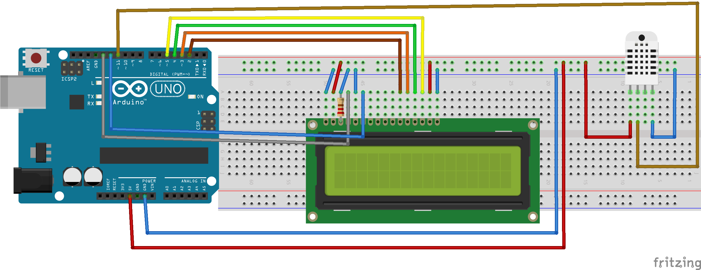
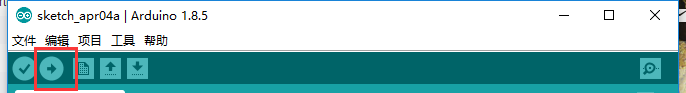

总操作流程
- 1、[LCD1602液晶显示屏单独测试成功](#arduino-01)
- 2、[温湿传感器测试环境单独单独测试成功](#arduino-02)
- 3、[修改连线](#arduino-03)
- 4、[修改代码](#arduino-04)
- 5、[测试](#arduino-05)

----------
# <a name="arduino-01" href="#" >LCD1602液晶显示屏单独测试成功</a>
# <a name="arduino-02" href="#" >温湿传感器测试环境单独单独测试成功</a>
# <a name="arduino-03" href="#" >修改连线</a>

# <a name="arduino-04" href="#" >修改代码</a>\

<details>
<summary>代码</summary>

```c
#include<LiquidCrystal.h>
#include <dht11.h>
dht11 DHT11;
#define DHT11PIN 11
LiquidCrystal lcd(13,12,2,3,4,5);
void setup(){
    lcd.begin(16,2);
}
void loop(){
    lcd.clear();
    int chk = DHT11.read(DHT11PIN);
    /**
     * 温度
     */
    lcd.setCursor(0,0);
    lcd.print("Tem(");
    lcd.print((char)223);//显示o符号
    lcd.print("C):");
    lcd.setCursor(8,0);
    lcd.print((float)DHT11.temperature, 1);
    /**
     * 湿度
     */
    lcd.setCursor(0,1);
    lcd.print("Hum(");
    lcd.print((char)37);//显示%符号
    lcd.print("):");
    lcd.setCursor(7,1);
    lcd.print((float)DHT11.humidity, 0);
    /**
     * 天数
     */
    lcd.setCursor(10,1);
    lcd.print("Day:");
    lcd.setCursor(14,1);
    lcd.print(22);
    delay(1000);
}
```

</details>

# <a name="arduino-05" href="#" >测试</a>



对温湿传感器喷水看效果