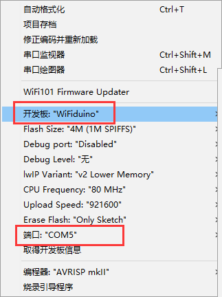
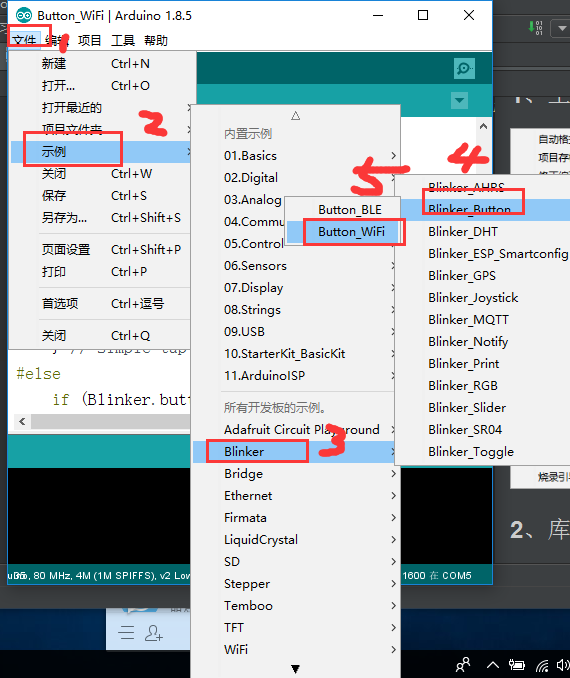
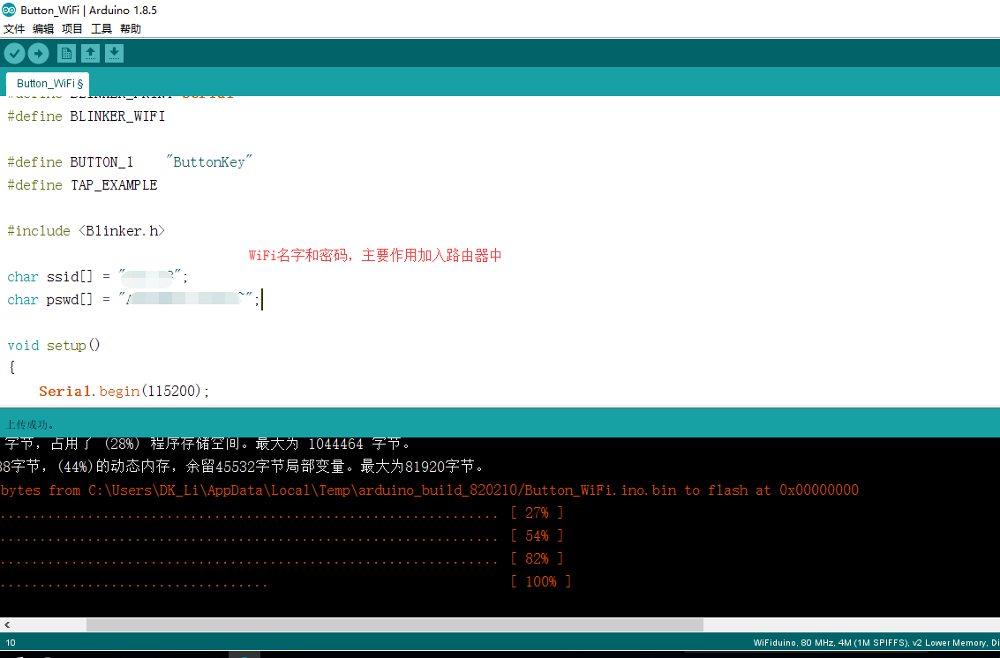
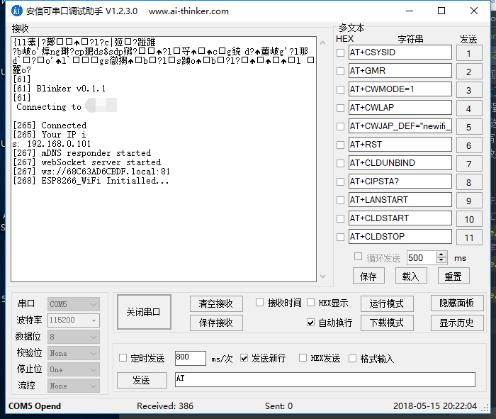

操作总流程：
- 1、[ide选好选项](#WiFiduino-01)
- 2、[烧写](#WiFiduino-02)
- 3、[看效果](#WiFiduino-03)

***
# <a name="WiFiduino-01" href="#" >ide选好选项</a>
### 1、工具项

### 2、库中文件

# <a name="WiFiduino-02" href="#" >烧写</a>

# <a name="WiFiduino-03" href="#" >看效果</a>
