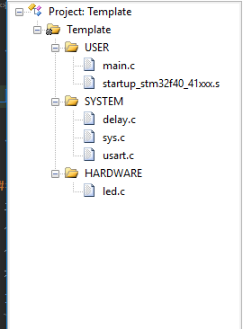
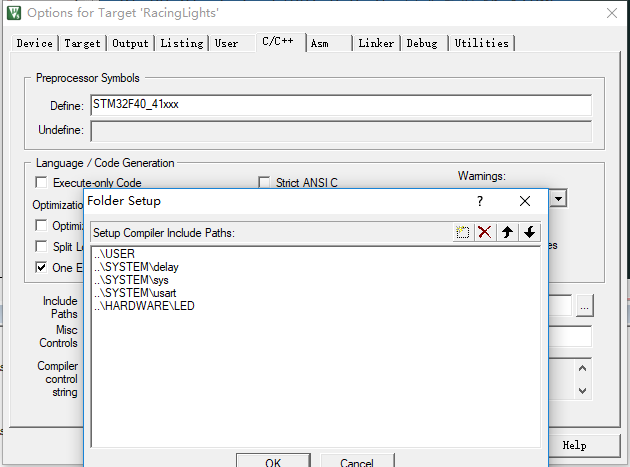

总操作流程：
- 1、[下载模板](#STM-M4-01)
- 2、[创建修改文件和配置环境](#STM-M4-02)
    - 2.[1、创建修改文件夹和文件](#STM-M4-02-01)
    - 2.[2、配置环境](#STM-M4-02-02)
- 3、[程序下载看效果](#STM-M4-03)


***

# <a name="STM-M4-01" href="#" >下载模板</a>

[](https://github.com/lidekai/Template-RegisterLibrary.git)

# <a name="STM-M4-02" href="#" >创建修改文件和配置环境</a>

### <a name="STM-M4-02-01" href="#" >1、创建修改文件夹和文件</a>
- 将根目录名改成：Template
- 创建OBJ文件夹
- 创建HARDWARE文件夹，且其下也创建LED文件夹
- 在LED文件夹下创建led.c和led.h文件
- led.h

<details>
<summary>代码</summary>

```h
#ifndef __LED_H
#define __LED_H
#include "sys.h"
//LED 端口定义
#define LED0 PFout(9) // DS0
#define LED1 PFout(10) // DS1
void LED_Init(void); //初始化
#endif

```

</details>

- led.c

<details>
<summary>代码</summary>

```c
#include "led.h"
//初始化 PF9 和 PF10 为输出口.并使能这两个口的时钟
//LED IO 初始化
void LED_Init(void)
{
	RCC->AHB1ENR|=1<<5;//使能 PORTF 时钟
	/**
	* 作用：PF9,PF10 设置
	* 解释：
	*      GPIOF:是IO 口。
	*      PIN9：是引脚编号，定义值是：1<<9。
	*      PIN10：是引脚编号，定义值是：1<<10。
	*      GPIO_MODE_OUT：是普通输出模式，定义值是：1。
	*      GPIO_OTYPE_PP：是推挽输出，定义值是：0。
	*      GPIO_SPEED_100M：是GPIO 速度 100Mhz，定义值是：3。
	*      GPIO_PUPD_PU: 是上拉，定义值是：0。
	*/
	GPIO_Set(GPIOF,
					 PIN9|PIN10,
					 GPIO_MODE_OUT,
					 GPIO_OTYPE_PP,
					 GPIO_SPEED_100M,
					 GPIO_PUPD_PU);

	LED0=1;//LED0 关闭
	LED1=1;//LED1 关闭
}

```

</details>

- 修改main.c文件内容

<details>
<summary>代码</summary>

```c
#include "sys.h"
#include "delay.h"
#include "led.h"
int main(void)
{
	Stm32_Clock_Init(336,8,2,7);//设置时钟,168Mhz
	delay_init(168); //初始化延时函数
	LED_Init(); //初始化 LED 时钟
	while(1)
	{
		LED0=0; //DS0 亮
		LED1=1; //DS1 灭
		delay_ms(500);
		LED0=1; //DS0 灭
		LED1=0; //DS1 亮
		delay_ms(500);
	}
}

```

</details>

### <a name="STM-M4-02-02" href="#" >2、配置环境</a>
- 导入文件



- 设置文件路径

`STM32F40_41xxx`




# <a name="STM-M4-03" href="#" >程序下载看效果</a>
- 编译


- 将程序下载到开发板


- 看效果

`开发板灯一闪闪的发亮`