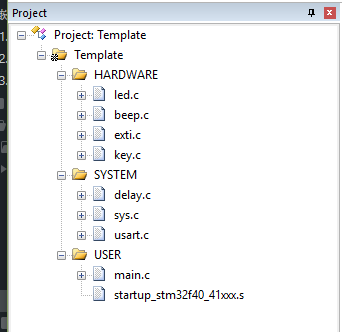
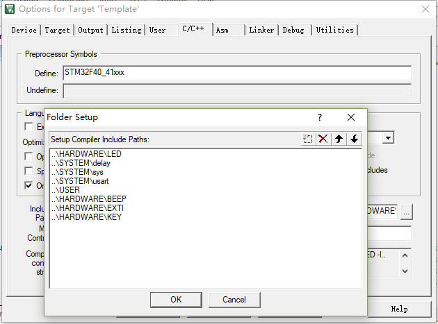
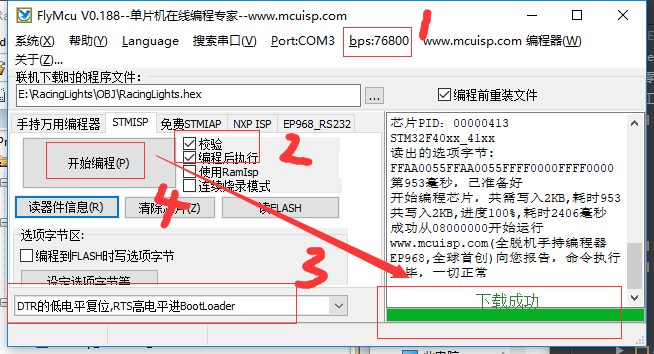

总操作流程：
- 1、[下载模板](#STM-M4-01)
- 2、[创建修改文件和配置环境](#STM-M4-02)
    - 2.[1、创建修改文件夹和文件](#STM-M4-02-01)
    - 2.[2、配置环境](#STM-M4-02-02)
- 3、[看效果](#STM-M4-03)

***

# <a name="STM-M4-01" href="#" >下载模板</a>

[](https://github.com/lidekai/Template-RegisterLibrary.git)

# <a name="STM-M4-02" href="#" >创建修改文件和配置环境</a>

### <a name="STM-M4-02-01" href="#" >1、创建修改文件夹和文件</a>

- 将根目录名改成：Template
- 创建OBJ文件夹
- 创建HARDWARE文件夹，且其下也创建EXTI文件夹
- 在EXTI文件夹下创建exti.c和exti.h文件
- exti.h

<details>
<summary>代码</summary>

```c
#ifndef __EXTI_H
#define __EXTI_H
#include "sys.h"
    void EXTIX_Init(void);// 外部中断初始化
#endif

```

</details>

- exti.c

<details>
<summary>代码</summary>

```c
#include "sys.h"
#include "delay.h"
#include "usart.h"
#include "led.h"
#include "beep.h"
#include "exti.h"
int main(void)
{
    Stm32_Clock_Init(336,8,2,7);//设置时钟,168Mhz
    delay_init(168); //延时初始化
    uart_init(84,115200); //串口初始化
    LED_Init(); //初始化与 LED 连接的硬件接口
    BEEP_Init(); //初始化蜂鸣器 IO
    EXTIX_Init(); //初始化外部中断输入
    LED0=0; //先点亮红灯
    while(1)
    {
        printf("OK\r\n");
        delay_ms(1000);
    }
}

```

</details>

- main.c

<details>
<summary>代码</summary>

```c
#include "exti.h"
#include "delay.h"
#include "led.h"
#include "key.h"
#include "beep.h"

//外部中断 0 服务程序
void EXTI0_IRQHandler(void)
{
    delay_ms(10); //消抖
    if(WK_UP==1) BEEP=!BEEP;
    EXTI->PR=1<<0; //清除 LINE0 上的中断标志位
}
//外部中断 2 服务程序
void EXTI2_IRQHandler(void)
{
    delay_ms(10); //消抖
    if(KEY2==0)
        LED0=!LED0;
    EXTI->PR=1<<2; //清除 LINE2 上的中断标志位
}
//外部中断 3 服务程序
void EXTI3_IRQHandler(void)
{
    delay_ms(10); //消抖
    if(KEY1==0)
        LED1=!LED1;
    EXTI->PR=1<<3; //清除 LINE3 上的中断标志位
}
//外部中断 4 服务程序
void EXTI4_IRQHandler(void)
{
    delay_ms(10); //消抖
    if(KEY0==0)
    {
        LED0=!LED0;
        LED1=!LED1;
    }
    EXTI->PR=1<<4; //清除 LINE4 上的中断标志位
}
//外部中断初始化程序
//初始化 PE2~4,PA0 为中断输入.
void EXTIX_Init(void)
{
    KEY_Init();
    Ex_NVIC_Config(GPIO_E,2,FTIR); //下降沿触发
    Ex_NVIC_Config(GPIO_E,3,FTIR); //下降沿触发
    Ex_NVIC_Config(GPIO_E,4,FTIR); //下降沿触发
    Ex_NVIC_Config(GPIO_A,0,RTIR); //上升沿触发
    MY_NVIC_Init(3,2,EXTI2_IRQn,2); //抢占 3，子优先级 2，组 2
    MY_NVIC_Init(2,2,EXTI3_IRQn,2); //抢占 2，子优先级 2，组 2
    MY_NVIC_Init(1,2,EXTI4_IRQn,2); //抢占 1，子优先级 2，组 2
    MY_NVIC_Init(0,2,EXTI0_IRQn,2); //抢占 0，子优先级 2，组 2
}

```

</details>

### <a name="STM-M4-02-02" href="#" >2、配置环境</a>

- 导入文件



- 设置文件路径

`STM32F40_41xxx`



# <a name="STM-M4-03" href="#" >看效果</a>

- 下载程序



- 看效果

`按五颗按钮有不同的反应`
