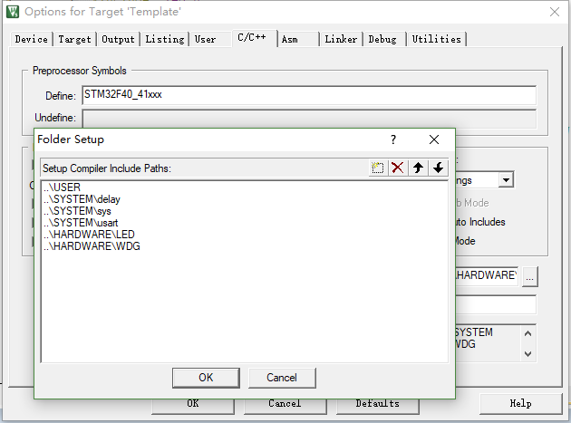
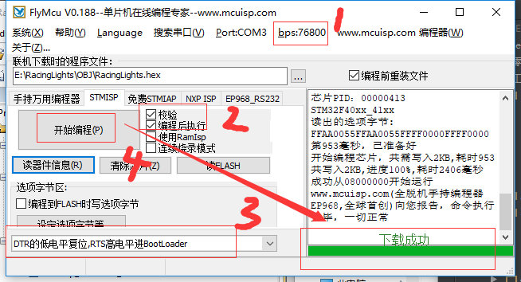

总操作流程：
- 1、[下载模板](#STM-M4-01)
- 2、[创建修改文件和配置环境](#STM-M4-02)
    - 2.[1、创建修改文件夹和文件](#STM-M4-02-01)
    - 2.[2、配置环境](#STM-M4-02-02)
- 3、[看效果](#STM-M4-03)

***

# <a name="STM-M4-01" href="#" >下载模板</a>

[](https://github.com/lidekai/Template-RegisterLibrary.git)

# <a name="STM-M4-02" href="#" >创建修改文件和配置环境</a>

### <a name="STM-M4-02-01" href="#" >1、创建修改文件夹和文件</a>

- 将根目录名改成：Template
- 创建OBJ文件夹
- 创建HARDWARE文件夹，且其下也创建WDG文件夹
- 在WDG文件夹下创建wdg.c和wdg.h文件
- wdg.h

<details>
<summary>代码</summary>

```h
#ifndef __WDG_H
#define __WDG_H
#include "sys.h"
  void IWDG_Init(u8 prer,u16 rlr);
  void IWDG_Feed(void);
#endif


```

</details>

- wdg.c

<details>
<summary>代码</summary>

```c
#include "wdg.h"
#include "led.h"
//初始化独立看门狗
//prer:分频数:0~7(只有低 3 位有效!)
//rlr:自动重装载值,0~0XFFF.
//分频因子=4*2^prer.但最大值只能是 256!
//rlr:重装载寄存器值:低 11 位有效.
//时间计算(大概):Tout=((4*2^prer)*rlr)/32 (ms).
void IWDG_Init(u8 prer,u16 rlr)
{
  IWDG->KR=0X5555;//使能对 IWDG->PR 和 IWDG->RLR 的写
  IWDG->PR=prer; //设置分频系数
  IWDG->RLR=rlr; //重加载寄存器 IWDG->RLR
  IWDG->KR=0XAAAA;//reload
  IWDG->KR=0XCCCC;//使能看门狗
}
//喂独立看门狗
void IWDG_Feed(void)
{
  IWDG->KR=0XAAAA;//reload
}

//保存 WWDG 计数器的设置值,默认为最大.
u8 WWDG_CNT=0x7f;
//初始化窗口看门狗
//tr :T[6:0],计数器值
//wr :W[6:0],窗口值
//fprer:分频系数（WDGTB） ,仅最低 2 位有效
//Fwwdg=PCLK1/(4096*2^fprer). 一般 PCLK1=42Mhz
void WWDG_Init(u8 tr,u8 wr,u8 fprer)
{
	RCC->APB1ENR|=1<<11; //使能 wwdg 时钟
	WWDG_CNT=tr&WWDG_CNT;//初始化 WWDG_CNT.
	WWDG->CFR|=fprer<<7; //PCLK1/4096 再除 2^fprer
	WWDG->CFR&=0XFF80;
	WWDG->CFR|=wr; //设定窗口值
	WWDG->CR|=WWDG_CNT;//设定计数器值
	WWDG->CR|=1<<7; //开启看门狗
	MY_NVIC_Init(2,3,WWDG_IRQn,2);//抢占 2，子优先级 3，组 2
	WWDG->SR=0X00; //清除提前唤醒中断标志位
	WWDG->CFR|=1<<9; //使能提前唤醒中断
}
//重设置 WWDG 计数器的值
void WWDG_Set_Counter(u8 cnt)
{
	WWDG->CR =(cnt&0x7F);//重设置 7 位计数器
}
//窗口看门狗中断服务程序
void WWDG_IRQHandler(void)
{
	WWDG_Set_Counter(WWDG_CNT);//重设窗口看门狗的值!
	WWDG->SR=0X00;//清除提前唤醒中断标志位
	LED1=!LED1;
}

```

</details>

- main.c

<details>
<summary>代码</summary>

```c
#include "delay.h"
#include "led.h"
#include "wdg.h"

int main(void) {
	Stm32_Clock_Init(336, 8, 2, 7); //设置时钟,168Mhz
	delay_init(168); //延时初始化
	LED_Init(); //初始化与 LED 连接的硬件接口
	LED0=0; //点亮 LED0
	delay_ms(300); //延时 300ms 再初始化看门狗,LED0 的变化"可见"
	WWDG_Init(0X7F,0X5F,3); //计数器值为 7f,窗口寄存器为 5f,分频数为 8
	while(1) {
		LED0=1; //关闭 LED0
	};
}

```

</details>

### <a name="STM-M4-02-02" href="#" >2、配置环境</a>

- 导入文件


- 设置文件路径

`STM32F40_41xxx`

P

# <a name="STM-M4-03" href="#" >看效果</a>

- 下载程序



- 看效果

`DS0 亮一下之后熄灭，紧接着 DS1 开始不停
的闪烁`
