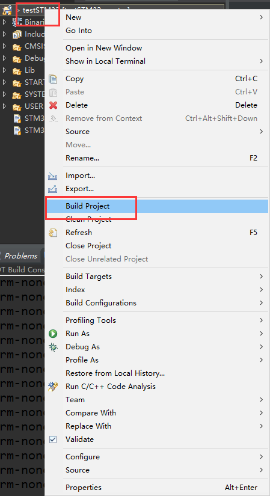

总操作流程：
- 1、[创建文件](#STM-M4-01)
- 2、[测试](#STM-M4-02)

> 该教程建立在5.STM32-M4之蜂鸣器基础上

***

# <a name="STM-M4-01" href="#" >创建文件</a>

> 1、根目录建立Module文件夹,且迁移led.c和led.h文件到其下
> 2、创建文件key.c和key.h文件

- key.c

<details>
<summary>代码</summary>

```c
#include "sys.h"
#include "usart.h"
////////////////////////////////////////////////////////////////////////////////// 	 
//如果使用ucos,则包括下面的头文件即可.
#if SYSTEM_SUPPORT_OS
#include "includes.h"					//ucos 使用	  
#endif

//加入以下代码,支持printf函数,而不需要选择use MicroLIB	  
#if 1
#pragma import(__use_no_semihosting)             
//标准库需要的支持函数                 
struct __FILE 
{ 
	int handle; 
}; 

FILE __stdout;       
//定义_sys_exit()以避免使用半主机模式    
_sys_exit(int x)
{ 
	x = x; 
} 
//重定义fputc函数 
int fputc(int ch, FILE *f)
{
	while((USART1->SR&0X40)==0);//循环发送,直到发送完毕   
	USART1->DR = (u8) ch;      
	return ch;
}
#endif

#if EN_USART1_RX   //如果使能了接收
//串口1中断服务程序
//注意,读取USARTx->SR能避免莫名其妙的错误   	
u8 USART_RX_BUF[USART_REC_LEN];     //接收缓冲,最大USART_REC_LEN个字节.
//接收状态
//bit15，	接收完成标志
//bit14，	接收到0x0d
//bit13~0，	接收到的有效字节数目
u16 USART_RX_STA=0;       //接收状态标记

//初始化IO 串口1
//bound:波特率
void uart_init(u32 bound){
   //GPIO端口设置
  GPIO_InitTypeDef GPIO_InitStructure;
	USART_InitTypeDef USART_InitStructure;
	NVIC_InitTypeDef NVIC_InitStructure;

	RCC_AHB1PeriphClockCmd(RCC_AHB1Periph_GPIOA,ENABLE); //使能GPIOA时钟
	RCC_APB2PeriphClockCmd(RCC_APB2Periph_USART1,ENABLE);//使能USART1时钟

	//串口1对应引脚复用映射
	GPIO_PinAFConfig(GPIOA,GPIO_PinSource9,GPIO_AF_USART1); //GPIOA9复用为USART1
	GPIO_PinAFConfig(GPIOA,GPIO_PinSource10,GPIO_AF_USART1); //GPIOA10复用为USART1

	//USART1端口配置
  GPIO_InitStructure.GPIO_Pin = GPIO_Pin_9 | GPIO_Pin_10; //GPIOA9与GPIOA10
	GPIO_InitStructure.GPIO_Mode = GPIO_Mode_AF;//复用功能
	GPIO_InitStructure.GPIO_Speed = GPIO_Speed_50MHz;	//速度50MHz
	GPIO_InitStructure.GPIO_OType = GPIO_OType_PP; //推挽复用输出
	GPIO_InitStructure.GPIO_PuPd = GPIO_PuPd_UP; //上拉
	GPIO_Init(GPIOA,&GPIO_InitStructure); //初始化PA9，PA10

   //USART1 初始化设置
	USART_InitStructure.USART_BaudRate = bound;//波特率设置
	USART_InitStructure.USART_WordLength = USART_WordLength_8b;//字长为8位数据格式
	USART_InitStructure.USART_StopBits = USART_StopBits_1;//一个停止位
	USART_InitStructure.USART_Parity = USART_Parity_No;//无奇偶校验位
	USART_InitStructure.USART_HardwareFlowControl = USART_HardwareFlowControl_None;//无硬件数据流控制
	USART_InitStructure.USART_Mode = USART_Mode_Rx | USART_Mode_Tx;	//收发模式
  USART_Init(USART1, &USART_InitStructure); //初始化串口1

  USART_Cmd(USART1, ENABLE);  //使能串口1

	//USART_ClearFlag(USART1, USART_FLAG_TC);

#if EN_USART1_RX
	USART_ITConfig(USART1, USART_IT_RXNE, ENABLE);//开启相关中断

	//Usart1 NVIC 配置
  NVIC_InitStructure.NVIC_IRQChannel = USART1_IRQn;//串口1中断通道
	NVIC_InitStructure.NVIC_IRQChannelPreemptionPriority=3;//抢占优先级3
	NVIC_InitStructure.NVIC_IRQChannelSubPriority =3;		//子优先级3
	NVIC_InitStructure.NVIC_IRQChannelCmd = ENABLE;			//IRQ通道使能
	NVIC_Init(&NVIC_InitStructure);	//根据指定的参数初始化VIC寄存器、

#endif

}


void USART1_IRQHandler(void)                	//串口1中断服务程序
{
	u8 Res;
#if SYSTEM_SUPPORT_OS 		//如果SYSTEM_SUPPORT_OS为真，则需要支持OS.
	OSIntEnter();    
#endif
	if(USART_GetITStatus(USART1, USART_IT_RXNE) != RESET)  //接收中断(接收到的数据必须是0x0d 0x0a结尾)
	{
		Res =USART_ReceiveData(USART1);//(USART1->DR);	//读取接收到的数据

		if((USART_RX_STA&0x8000)==0)//接收未完成
		{
			if(USART_RX_STA&0x4000)//接收到了0x0d
			{
				if(Res!=0x0a)USART_RX_STA=0;//接收错误,重新开始
				else USART_RX_STA|=0x8000;	//接收完成了 
			}
			else //还没收到0X0D
			{	
				if(Res==0x0d)USART_RX_STA|=0x4000;
				else
				{
					USART_RX_BUF[USART_RX_STA&0X3FFF]=Res ;
					USART_RX_STA++;
					if(USART_RX_STA>(USART_REC_LEN-1))USART_RX_STA=0;//接收数据错误,重新开始接收	  
				}		 
			}
		}
  }
#if SYSTEM_SUPPORT_OS 	//如果SYSTEM_SUPPORT_OS为真，则需要支持OS.
	OSIntExit();  											 
#endif
} 
#endif
```

</details>

- key.h

<details>
<summary>代码</summary>

```c
#ifndef __KEY_H
#define __KEY_H
#include "sys.h"
/*下面的方式是通过直接操作库函数方式读取 IO*/
#define KEY0 GPIO_ReadInputDataBit(GPIOE,GPIO_Pin_4) //PE4
#define KEY1 GPIO_ReadInputDataBit(GPIOE,GPIO_Pin_3) //PE3
#define KEY2 GPIO_ReadInputDataBit(GPIOE,GPIO_Pin_2) //PE2
#define WK_UP GPIO_ReadInputDataBit(GPIOA,GPIO_Pin_0) //PA0
#define KEY0_PRES 1
#define KEY1_PRES 2
#define KEY2_PRES 3
#define WKUP_PRES 4
void KEY_Init(void); //IO 初始化
u8 KEY_Scan(u8); //按键扫描函数
#endif

```

</details>


> 3、修改main.c文件

- main.c

<details>
<summary>代码</summary>

```c
#include "sys.h"
#include "delay.h"
#include "usart.h"
#include "led.h"
#include "beep.h"
#include "key.h"
int main(void)
{
	u8 key; //保存键值
	delay_init(168); //初始化延时函数
	LED_Init(); //初始化 LED 端口
	BEEP_Init(); //初始化蜂鸣器端口
	KEY_Init(); //初始化与按键连接的硬件接口
	LED0=0; //先点亮红灯
	while(1)
		{ key=KEY_Scan(0); //得到键值
			if(key)
			{ switch(key)
				{
				case WKUP_PRES: //控制蜂鸣器
					BEEP=!BEEP;
					break;
				case KEY0_PRES: //控制 LED0 翻转
					LED0=!LED0;
					break;
				case KEY1_PRES: //控制 LED1 翻转
					LED1=!LED1;
					break;
				case KEY2_PRES: //同时控制 LED0,LED1 翻转
					LED0=!LED0;
					LED1=!LED1;
					break;
			}
		}else
			delay_ms(10);
	}
}

```

</details>


# <a name="STM-M4-02" href="#" >测试</a>




