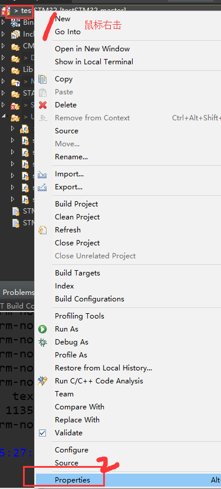
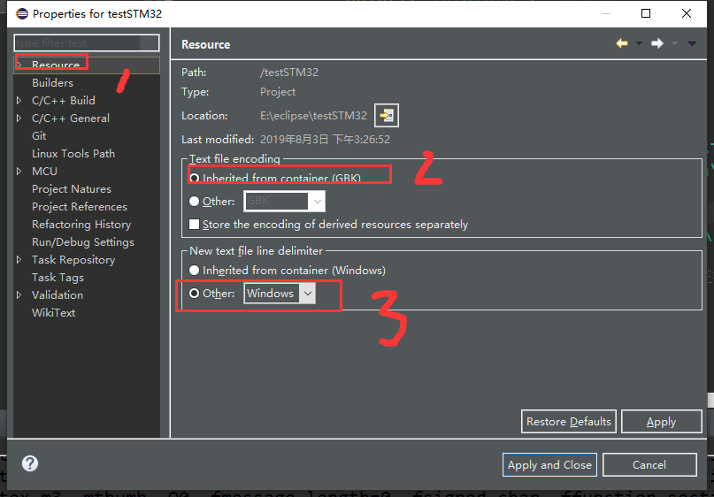
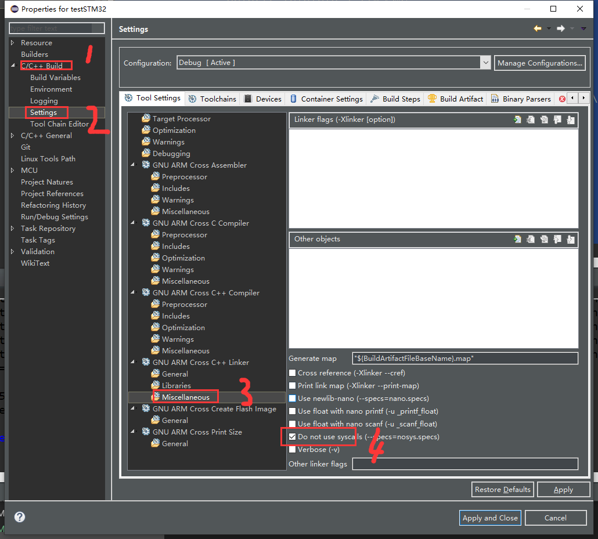
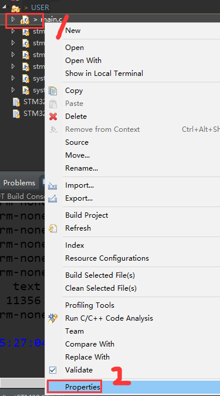
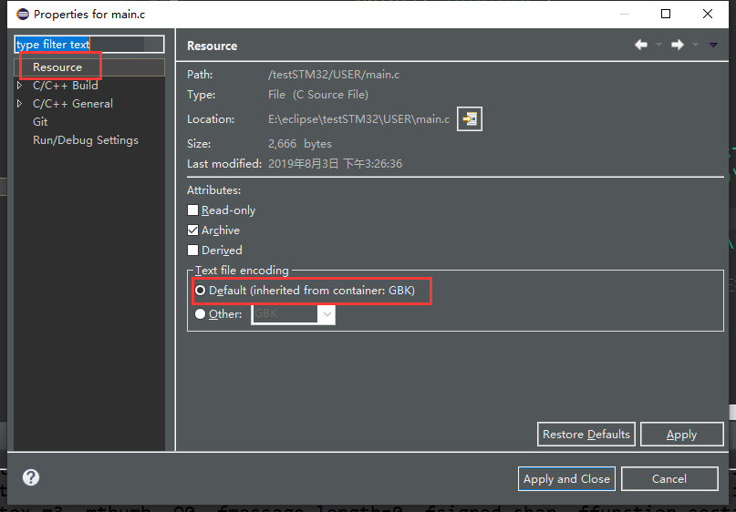

总操做流程：
- 1、[配置](#STM-M4-01)
- 2、[写代码](#STM-M4-02)
- 3、[测试](#STM-M4-03)

***

# <a name="STM-M4-01" href="#" >配置</a>











# <a name="STM-M4-02" href="#" >写代码</a>

> main.c

<details>
<summary>代码</summary>

```c
#include "sys.h"
#include "delay.h"
#include "usart.h"
#include "led.h"
#include "beep.h"
#include "key.h"

    int _fstat (int fd, struct stat *pStat)
    {

        return 0;
    }

    int _close()
    {
        return -1;
    }

    int _write (int fd, char *pBuffer, int size)
    {
        for (int i = 0; i < size; i++)
        {
            while (!(USART1->SR & USART_SR_TXE))
            {
            }
            USART_SendData(USART1, pBuffer[i]);
        }
        return size;
    }

    int _isatty (int fd)
    {
        return 1;
    }

    int _lseek()
    {
        return -1;
    }

    int _read (int fd, char *pBuffer, int size)
    {
        for (int i = 0; i < size; i++)
        {
            while ((USART1->SR & USART_SR_RXNE) == 0)
            {
            }

            pBuffer[i] = USART_ReceiveData(USART1);
        }
        return size;
    }

    caddr_t _sbrk(int increment)
    {
        extern char end asm("end");
        register char *pStack asm("sp");

        static char *s_pHeapEnd;

        if (!s_pHeapEnd)
            s_pHeapEnd = &end;

        if (s_pHeapEnd + increment > pStack)
            return (caddr_t)-1;

        char *pOldHeapEnd = s_pHeapEnd;
        s_pHeapEnd += increment;
        return (caddr_t)pOldHeapEnd;
    }


int main(void)
{
	u8 t,len; u16 times=0;
	NVIC_PriorityGroupConfig(NVIC_PriorityGroup_2);//设置系统中断优先级分组 2
	delay_init(168); //延时初始化
	uart_init(115200); //串口初始化波特率为 115200
	LED_Init(); //初始化与 LED 连接的硬件接口
	LED0=0; //先点亮红灯
	printf("\r\n 您发送的消息为:\r\n");
	while(1)
	    {
	        if(USART_RX_STA&0x8000)
	        {
	            len=USART_RX_STA&0x3fff;//得到此次接收到的数据长度
	            printf("\r\n 您发送的消息为:\r\n");
	            for(t=0;t<len;t++)
	            {
	                USART1->DR=USART_RX_BUF[t];
	                while((USART1->SR&0X40)==0);//等待发送结束
	            }
	            printf("\r\n\r\n");//插入换行
	            USART_RX_STA=0;
	        }else
	            {
	                times++;
	                if(times%5000==0)
	                {
	                    printf("\r\nALIENTEK 探索者 STM32F407 开发板 串口实验\r\n");
	                    printf("正点原子@ALIENTEK\r\n\r\n\r\n");
	                }
	                if(times%200==0)
	                    printf("请输入数据,以回车键结束\r\n");
	                if(times%30==0)
	                    LED0=!LED0;//闪烁 LED,提示系统正在运行.
	                delay_ms(10);
	        }
	    }
}

```

</details>

# <a name="STM-M4-03" href="#" >测试</a>

> 注意：写代码的时候“波特率”115200    
>       程序和串口助手一定要选115200


