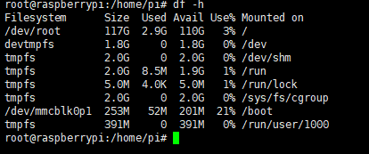
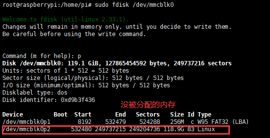
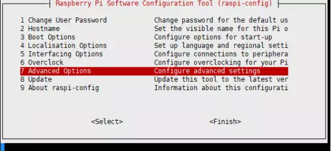
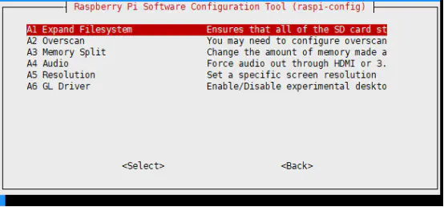

总操作流程：
- 1、[获取分区大小](#Linux-01)
- 2、[分区](#Linux-02)
- 3、[查看](#Linux-03)

***

# <a name="Linux-01" href="#" >获取分区大小</a>

```
df -lh
```



```
sudo fdisk /dev/mmcblk0
```

> 按P



- 将看到的分区复制下来/dev/mmcblk0p2的start值 (532480)

# <a name="Linux-02" href="#" >分区</a>

> 执行命令：d  （删除分区2,选择2）

> 执行命令：p （按这时候应该是少了一个分区了）

> 执行命令：n  (加分区)

> 执行命令：p （主要分区）

> 选择2

> 在开始位置输入start的值 (532480)

> 输入提供的最大值

> 选择n

> 执行命令：w

```
sudo reboot

sudo resize2fs /dev/mmcblk0p2

sudo raspi-config
```






# <a name="Linux-02" href="#" >查看</a>

```
df -lh
```