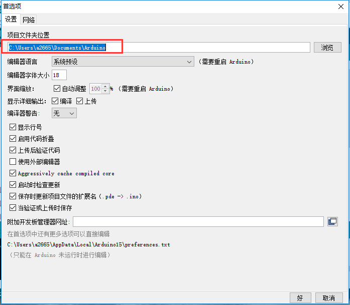
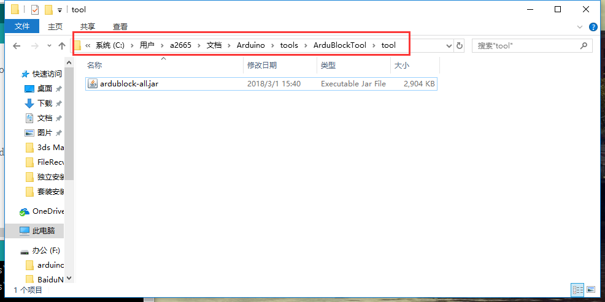
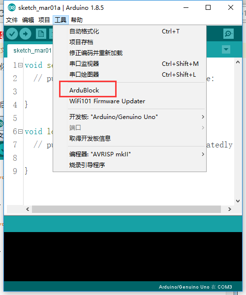
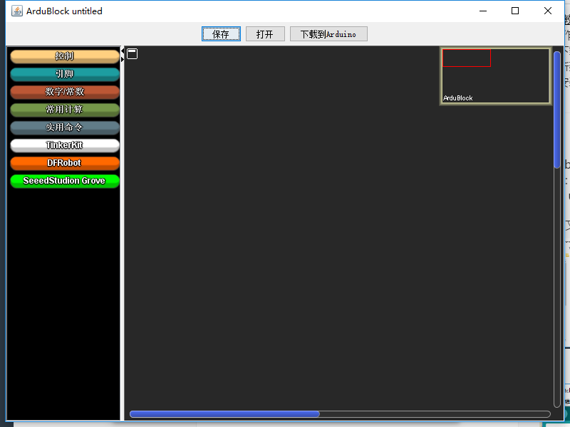

总操作流程：
- 1、[下载](#ArduBlockArduBlock-01)
- 2、[jar放到文件夹里](#ArduBlockArduBlock-02)
- 3、[测试](#ArduBlockArduBlock-03)

----------
# <a name="ArduBlockArduBlock-01" href="#" >下载</a>

# <a name="ArduBlockArduBlock-02" href="#" >新建文件夹和将jar放到文件夹里</a>
在Sketchbook location下创建文件夹

# <a name="ArduBlockArduBlock-03" href="#" >测试</a>

