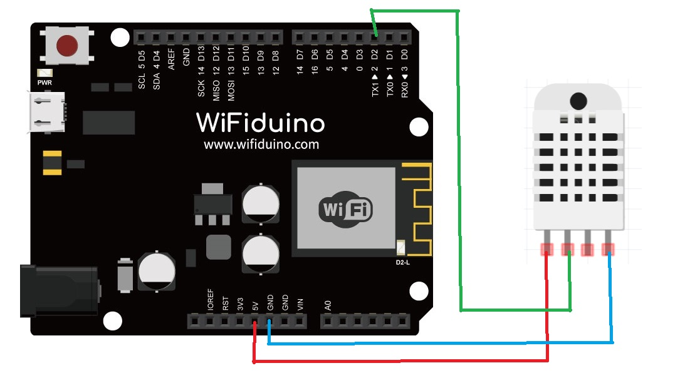

总操流程：
- 1、[各器件链接](#WiFiduino-01)
- 2、[烧写程序](#WiFiduino-02)

***

# <a name="WiFiduino-01" href="#" >各器件链接</a>

# <a name="WiFiduino-02" href="#" >烧写程序</a>
```c
/**
   BasicHTTPClient.ino

    Created on: 24.05.2015

*/

#include <Arduino.h>

#include <ESP8266WiFi.h>
#include <ESP8266WiFiMulti.h>
#include <ESP8266HTTPClient.h>
#define USE_SERIAL Serial
#include <dht11.h>
dht11 DHT11;
#define DHT11PIN 2
ESP8266WiFiMulti WiFiMulti;

void setup() {
  Serial.begin(9600);
  USE_SERIAL.begin(115200);
  // USE_SERIAL.setDebugOutput(true);

  USE_SERIAL.println();
  USE_SERIAL.println();
  USE_SERIAL.println();

  for (uint8_t t = 4; t > 0; t--) {
    USE_SERIAL.printf("[SETUP] WAIT %d...\n", t);
    USE_SERIAL.flush();
    delay(1000);
  }

  WiFi.mode(WIFI_STA);
  WiFiMulti.addAP("WE-178", "123456789o");

}

void loop() {
      int chk = DHT11.read(DHT11PIN);
    switch (chk)
      {
        case DHTLIB_OK: 
                    Serial.println("OK"); 
                    break;
        case DHTLIB_ERROR_CHECKSUM: 
                    Serial.println("Checksum error"); 
                    break;
        case DHTLIB_ERROR_TIMEOUT: 
                    Serial.println("Time out error"); 
                    break;
        default: 
                    Serial.println("Unknown error"); 
                    break;
      }

    float humi=(float)DHT11.humidity;
    float temp=(float)DHT11.temperature;
    delay(3000);
  // wait for WiFi connection
  if ((WiFiMulti.run() == WL_CONNECTED)) {

    HTTPClient http;

    USE_SERIAL.print("[HTTP] begin...\n");
    // configure traged server and url
    //http.begin("https://192.168.1.12/test.html", "7a 9c f4 db 40 d3 62 5a 6e 21 bc 5c cc 66 c8 3e a1 45 59 38"); //HTTPS
    String httpGet="http://192.168.0.90:8080/esp8266/getWiFiData?temperature="+(String)temp+"&humidity="+(String)humi;
    http.begin(httpGet); //HTTP

    USE_SERIAL.print("[HTTP] GET...\n");
    // start connection and send HTTP header
    int httpCode = http.GET();

    // httpCode will be negative on error
    if (httpCode > 0) {
      // HTTP header has been send and Server response header has been handled
      USE_SERIAL.printf("[HTTP] GET... code: %d\n", httpCode);

      // file found at server
      if (httpCode == HTTP_CODE_OK) {
        String payload = http.getString();
        USE_SERIAL.println(payload);
      }
    } else {
      USE_SERIAL.printf("[HTTP] GET... failed, error: %s\n", http.errorToString(httpCode).c_str());
    }

    http.end();
  }

  delay(10000);
}


```