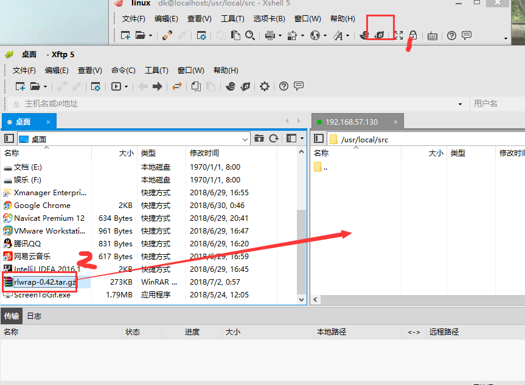

总操作流程：
- 1、[下载安装](#Linux-01)
- 2、[修改配置文件](#Linux-02)

***

# <a name="Linux-01" href="#" >下载安装</a>
### 1、下载
[](https://pan.baidu.com/s/1vvpB1VV7MNh42Wj5XnDESA)

```shell
cd /usr/local/src
chmod  0777 /usr/local/src #给目录写权限
```
- 上传


### 2、安装
```shell
# 安装readline
yum install readline*

tar -xzvf rlwrap-0.43.tar.gz  #解压

rm -rf rlwrap-0.43.tar.gz #删除包

cd rlwrap-0.43

./configure --prefix=/usr/local/rlwrap # 配置

make  #编译

make install  #安装

cd /usr/local/src

rm -rf rlwrap-0.43

```
# <a name="Linux-02" href="#" >修改配置文件</a>
### 1、切换到oracle用户，编辑bash_profile文件
```shell
su dk

cd ~

vi .bash_profile
```
- 添加内容:
```shell
# rlwrap的环境变量
export PATH=$PATH:/usr/local/rlwrap/bin
alias sqlplus='rlwrap sqlplus'
alias rman='rlwrap rman'
```
### 2、 是修改生效
```shell
source .bash_profile
```
### 3、查看是否安装成功
```shell
rlwrap -v
```