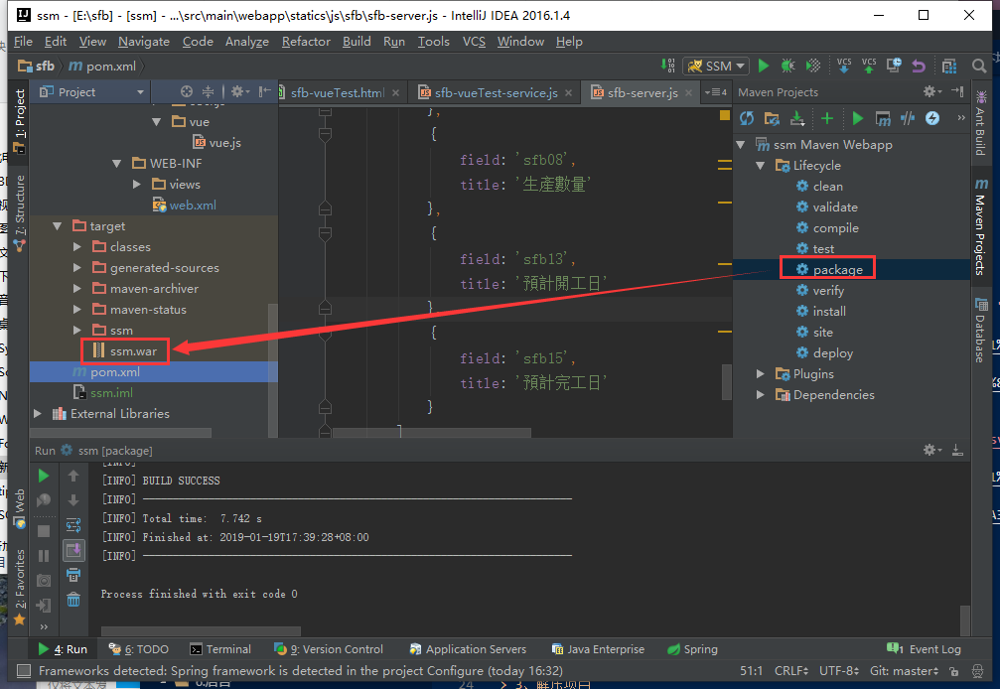

总操作流程：
- 1、[Javaweb运行环境确认](#tomcat-01)
- 2、[上传项目](#tomcat-02)
- 3、[看效果](#tomcat-03)

***

# <a name="tomcat-01" href="#" >Javaweb运行环境确认</a>

> 本Javaweb是ssm+oracle+maven

centos要安装jdk，tomcat

[](https://github.com/OurNotes/CCN/blob/master/04.%E6%9C%8D%E5%8A%A1%E5%99%A8/01.linux/02.linux%E4%B9%8B%E5%AE%89%E8%A3%85%E8%BD%AF%E4%BB%B6/06.Linux%E4%B9%8B%E5%AE%89%E8%A3%85JDK.md)

[](https://github.com/OurNotes/CCN/blob/master/04.%E6%9C%8D%E5%8A%A1%E5%99%A8/03.tomcat/01.tomcat%E4%B9%8B%E5%AD%A6%E4%B9%A0/01.tomcat%E4%B9%8B%E5%AE%89%E8%A3%85%E9%85%8D%E7%BD%AE.md)

注意：maven无法下载oracle驱动包的，将oracle包手动加到lib文件夹下

# <a name="tomcat-02" href="#" >上传项目</a>

> 1、导出项目

- 先清理项目


- 导出项目



> 2、上传项目

- 将项目解压出来，放到ssm文件夹下

```
jar -xvf ssm.war
```

- 上传项目到/usr/local/tomcat/webapps文件夹下

> 3、修改server.xml配置

```xml
<Context path="/" docBase="ssm" reloadable="true"/>  
```

# <a name="tomcat-03" href="#" >看效果</a>

```
http://ip地址:tomcat端口
```
