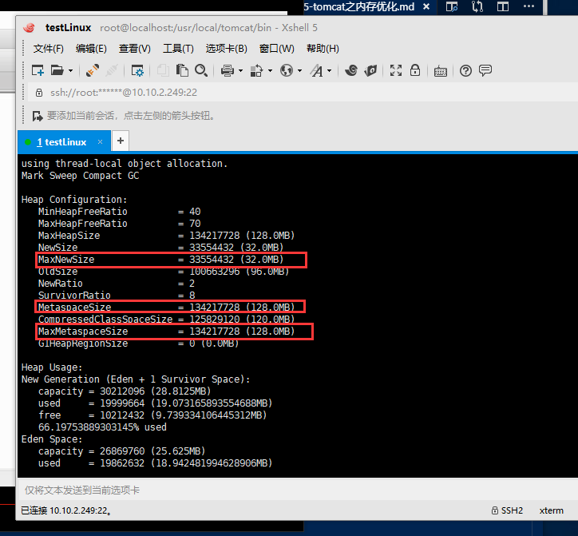

总操作流程:
- 1、[配置tomcat的catalina.sh文件](#tomcat-01)
- 2、[看效果](#tomcat-02)

***

# <a name="tomcat-01" href="#" >配置tomcat的catalina.sh文件</a>

```shell
vim /usr/local/tomcat/bin/catalina.sh
```

```shell
# OS specific support.  $var _must_ be set to either true or false.
JAVA_OPTS="-server -Xms512m -Xmx1024m -Xss1024K -XX:MetaspaceSize=512m -XX:MaxMetaspaceSize=512m -XX:MaxNewSize=32m"
```

```

chown 777 /usr/local/tomcat/bin/catalina.sh
```
# <a name="tomcat-02" href="#" >看效果</a>

```shell
ps -ef|grep tomcat  #查询编号

jmap -heap xxxx
```

