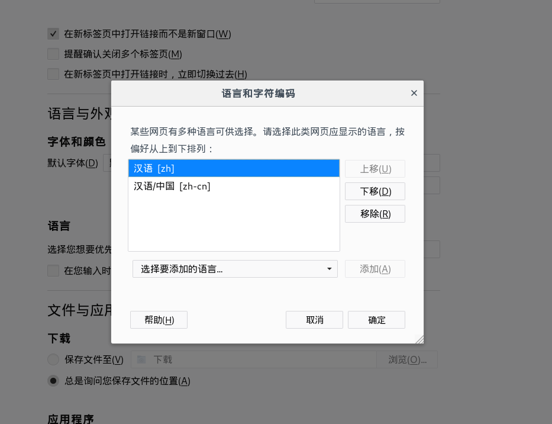

总操作流程：
- 1、[下载安装](#kail-linux-01)
- 2、[配置](#kail-linux-02)
- 3、[看效果](#kail-linux-03)

--------

# <a name="kail-linux-01" href="#" >下载安装</a>

```js
 apt -y install firefox-esr-l10n-zh-cn 
```

# <a name="kail-linux-02" href="#" >配置</a>



# <a name="kail-linux-03" href="#" >看效果</a>

重启浏览器看效果
