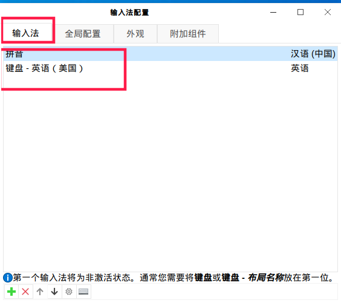
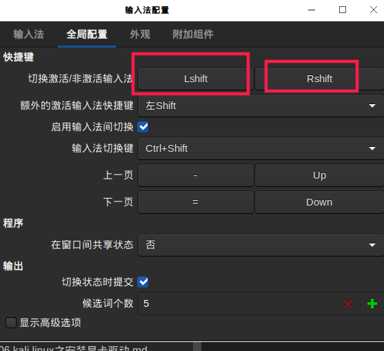

总操作流程:
- 1.[下载安装](#kail-linux-01)
- 2.[配置](#kail-linux-02)

***

# <a name="kail-linux-01" href="#" >下载安装</a>

```
apt-get install im-switch libapt-pkg-perl fcitx fcitx-table-wbpy

im-switch -s fcitx

reboot
```

# <a name="kail-linux-02" href="#" >配置</a>






