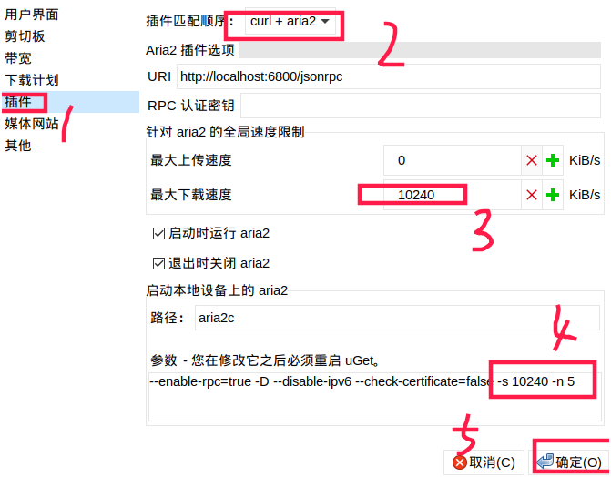

总操作流程
- 1、[下载安装(#kail-linux-01)
- 2、[配置(#kail-linux-02)
- 3、[测试(#kail-linux-03)

****

# <a name="kail-linux-01" href="#" >下载安装</a>

```
apt-get -y install uget aria2
```

# <a name="kail-linux-02" href="#" >配置</a>

> 编辑 > 设置



# <a name="kail-linux-03" href="#" >测试</a>


