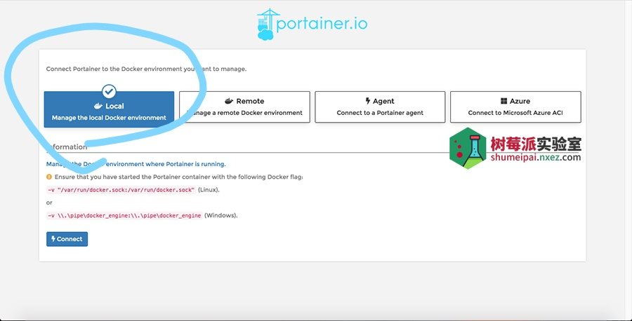

总操作流程：
- 1、[下载](#docker-01)
- 2、[配置](#docker-02)
- 3、[测试](#docker-03)

***

# <a name="docker-01" href="#" >下载</a>

```shell
docker pull redis:latest
docker pull zvelo/redis-trib:latest

# 创建虚拟网卡
docker network create redis-master
docker network create redis-slave

# 查看redis-net虚拟网卡网关ip
docker network inspect redis-master
docker network inspect redis-slave
```

# <a name="docker-02" href="#" >配置</a>

> 创建redis配置文件

```shell
mkdir -p /usr/local/redis-cluster
cd /usr/local/redis-cluster
touch redis-cluster.tmpl
chmod 0777 redis-cluster.tmpl
vim redis-cluster.tmpl
```

```shell
port ${PORT}
protected-mode no
cluster-enabled yes
pidfile  /var/run/redis_${PORT}.pid 
cluster-config-file nodes_${PORT}.conf
cluster-node-timeout 15000
cluster-announce-port ${PORT}
cluster-announce-bus-port 1${PORT}
appendonly yes
```

> 创建文件夹和文件

```shell

# 生成conf、data文件夹和配置信息
for port in `seq 6661 6666`; do \
  mkdir -p ./${port}/conf \
  && PORT=${port} envsubst < ./redis-cluster.tmpl > ./${port}/conf/redis.conf \
  && mkdir -p ./${port}/data \
  && chmod 777 ./${port}/conf/redis.conf; \
done
```
> 创建redis容器

```shell
for port in ` seq 6661 6663 `; do \
  docker run -d -ti -p ${port}:${port} -p 1${port}:1${port} \
  -v /usr/local/redis-cluster/${port}/conf/redis.conf:/etc/redis/redis.conf:rw \
  --restart always --name redis-${port} --net redis-master \
  --sysctl net.core.somaxconn=1024 redis redis-server /etc/redis/redis.conf; \
done

for port in ` seq 6664 6666 `; do \
  docker run -d -ti -p ${port}:${port} -p 1${port}:1${port} \
  -v /usr/local/redis-cluster/${port}/conf/redis.conf:/etc/redis/redis.conf:rw \
  --restart always --name redis-${port} --net redis-slave \
  --sysctl net.core.somaxconn=1024 redis redis-server /etc/redis/redis.conf; \
done
```

> 防火墙开放端口

```shell
for port in `seq 6661 6666`; do \
   firewall-cmd --permanent --zone=public --add-port=${port}/tcp; \
   firewall-cmd --permanent --zone=public --add-port=1${port}/tcp; \
done 
firewall-cmd --reload
```

> 连接集群

- 创建redis集群的三个master节点

```shell
docker run  -it --net redis-master \
                --rm zvelo/redis-trib create \
                --replicas 0 \
                192.168.42.128:6661 \
                192.168.42.128:6662 \
                192.168.42.128:6663;
```



- 再指定三个对应的slave节点

```
docker run --rm -it zvelo/redis-trib add-node \
           --slave \
           --master-id \
           befc17f14460e998cb22b32d30ac5361e0389657 \
           192.168.42.128:6664 \
           192.168.42.128:6661;


docker run --rm -it zvelo/redis-trib add-node \
           --slave \
           --master-id \
           a0a3720b16048b25abb6655d95558dc0ebc50195 \
           192.168.42.128:6665 \
           192.168.42.128:6662;


docker run --rm -it zvelo/redis-trib add-node \
           --slave \
           --master-id \
           ba64babbb687848ed947080b13c6ab27979459a0 \
           192.168.42.128:6666 \
           192.168.42.128:6663;

```


- 注意出现提问：Can I set the above configuration? (type 'yes' to accept): 输入：yes

# <a name="docker-03" href="#" >测试</a>

> 测试

```
docker run -it --link redis-6663:redis --net redis-master --rm redis redis-cli -h 192.168.42.128 -c -p 6663

set myKey abc

GET myKey
```

> 测试


- 也可以使用软件链接测试

[](https://pan.baidu.com/s/1b1lGG7umXfaB4dxk8sVpBQ)

提取码：4pmw
