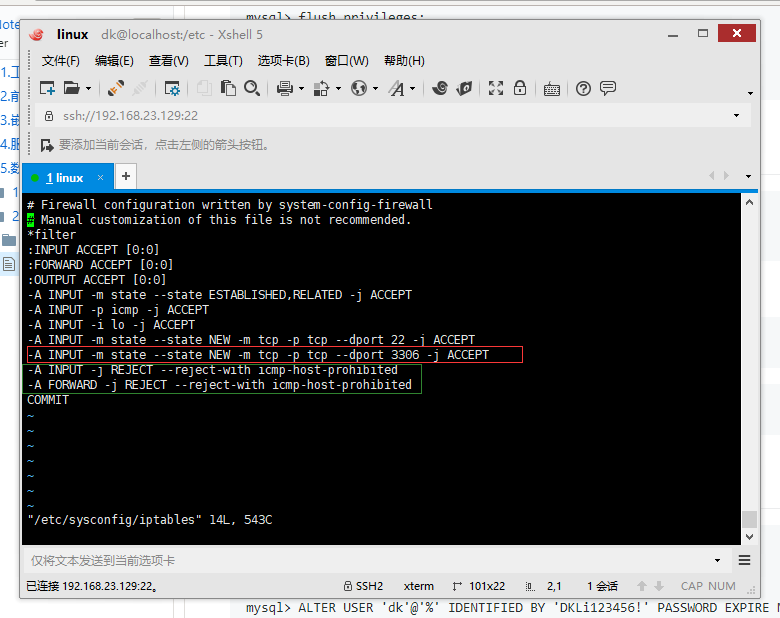
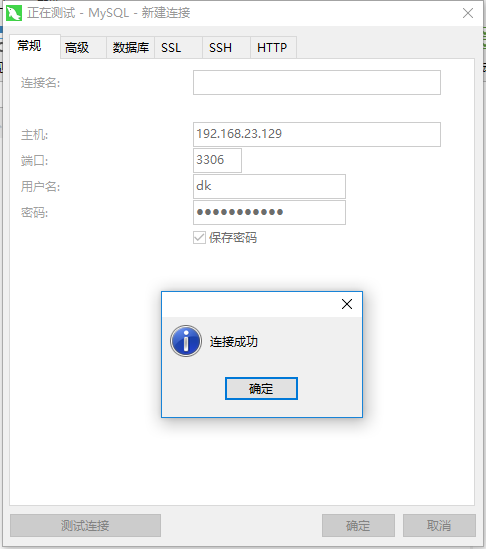

总操作流程：
- 1、[获取mysql的端口号](#navicat-01)
- 2、[创建一个远程用户，并赋予权限](#navicat-02)
- 3、[设置防火墙](#navicat-03)
- 4、[修改加密规则](#navicat-04)

----------

# <a name="navicat-01" href="#" >获取mysql的端口号</a>
```
mysql -u root -p #登陆mysql

mysql> use mysql;
#查看端口
mysql> show global variables like 'port'; 
```
# <a name="navicat-02" href="#" >创建一个远程用户，并赋予权限</a>
### 1、创建用户
```
mysql> CREATE USER 'dk'@'%' IDENTIFIED BY 'DKLi123456!';
mysql> flush privileges;
```
### 2、创建数据库，并赋予权限
```
#创建数据库
mysql> create database test;
mysql> GRANT all privileges ON test.* TO 'dk'@'%' WITH GRANT OPTION;
mysql> flush privileges; 
mysql> quit;  

service mysqld restart #重启mysql
```
# <a name="navicat-03" href="#" >设置防火墙</a>

```
vi  /etc/sysconfig/iptables #打开防火墙配置文件

```
`注意：增加的开放3306端口的语句一定要在icmp-host-prohibited之前`

```
-A INPUT -m state --state NEW -m tcp -p tcp --dport 3306 -j ACCEPT
```


```
service  iptables restart #重启防火墙
```

# <a name="navicat-04" href="#" >修改加密规则</a>
```
mysql -u root -p

# 修改加密规则
mysql> ALTER USER 'dk'@'%' IDENTIFIED BY 'DKLi123456!' PASSWORD EXPIRE NEVER;

#更新一下用户的密码 
mysql> ALTER USER 'dk'@'%' IDENTIFIED WITH mysql_native_password BY 'DKLi123456!';

#刷新权限 
mysql> FLUSH PRIVILEGES;

#再重置下密码
mysql> alter user 'dk'@'%' identified by 'DKLi123456!';

mysql> FLUSH PRIVILEGES;

mysql> quit;

service mysqld restart #重启mysql
```
