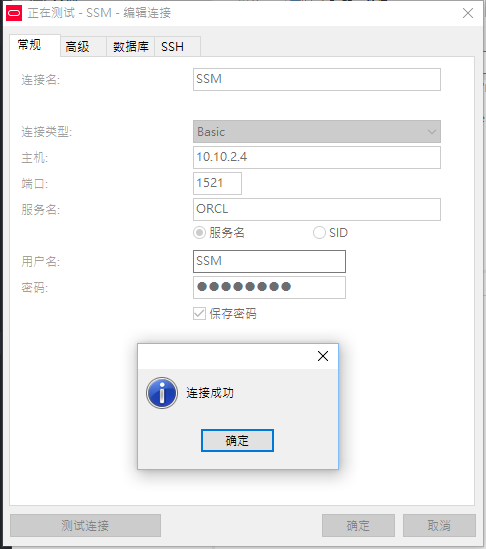
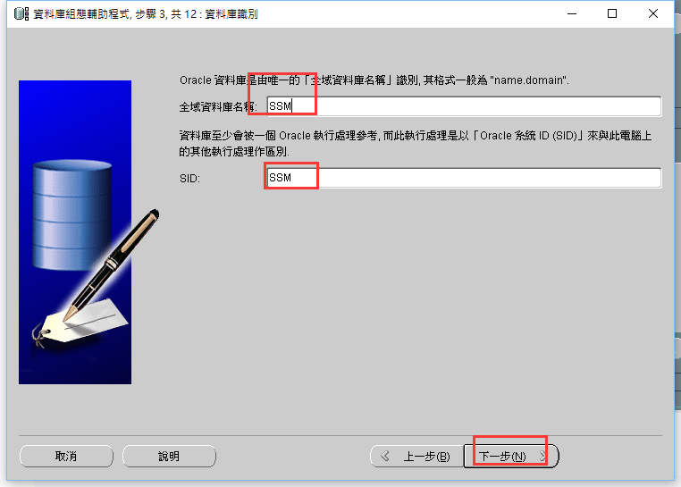
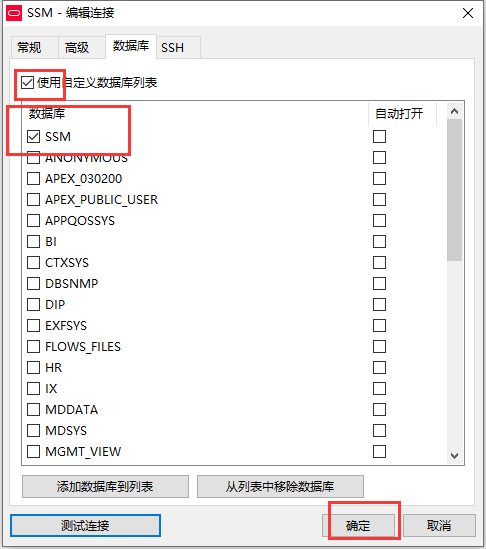
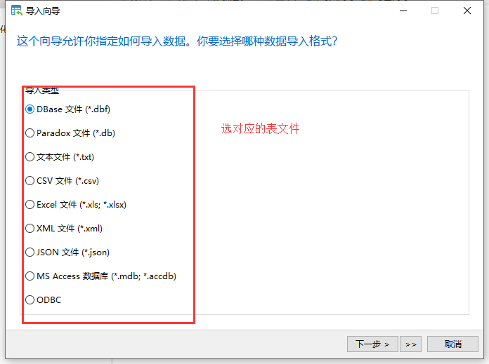

总操作流程：
- 1、创建用户
- 2、创建数据库
- 3、连接数据库
- 4、导入表

***

# 创建用户

```sql
create user SSM identified by "123456";

grant  connect,resource,dba,create session,create any table,select any dictionary to SSM;

alter user SSM account unlock;
```

- 测试




# 创建数据库

```
dbca
```




# 连接数据库





# 导入表


