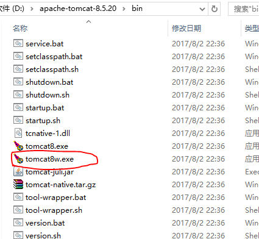

操作总流程：
- 1、[找到要修改的配置文件](#java-01)
- 2、[修改端口](#java-01)
- 3、[重启tomcat](#java-01)
- 4、[测试](#java-01)

----------
# <a name="java-01" href="#" >找到要修改的配置文件</a>
打开tomcat所在的conf文件夹的server.xml文件

# <a name="java-02" href="#" >修改端口</a>
找到等代码：
Connector port="8080"......
将8080改为自己想改的端口，这里我改为2222保存退出；

# <a name="java-03" href="#" >重启tomcat</a>

# <a name="java-04" href="#" >测试</a>
在浏览器输入：http://localhost:2222/

成功标准：

