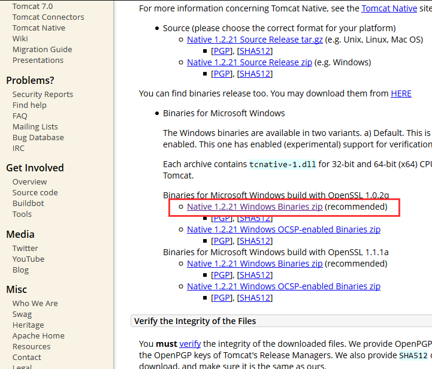

总操作流程：
- 1、[下载导入](#java-01)
- 2、[配置](#java-02)

****

# <a name="java-01" href="#" >下载导入</a>

[](http://tomcat.apache.org/download-native.cgi)



>将tcnative-1.dll文件复制到jdk的bin目录下

# <a name="java-02" href="#" >配置</a>

>配置server.xml
```xml
<Connector port="8089"
           protocol="org.apache.coyote.http11.Http11AprProtocol"
           connectionTimeout="20000"
           maxConnections="2000"
           maxThreads="500"
           acceptCount="500"
           minSpareThreads="100"
           compression="true"
           compressionMinSize="2048"
           redirectPort="8443" />
```