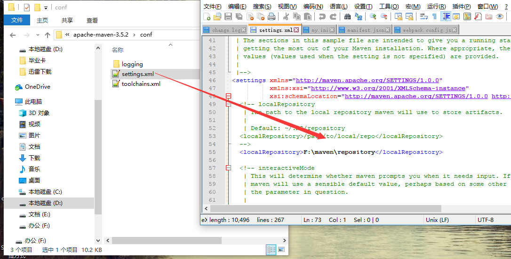

总操作流程：
- 1、[修改maven的包下载位置配置文件](#java-01)
- 2、[打开配置界面](#java-02)
- 3、[导入文件根目录](#java-03)

----------
# <a name="java-01" href="#" >修改maven的包下载位置配置文件</a>



# <a name="java-02" href="#" >打开配置界面</a>

window > preferences > Maven

# <a name="java-03" href="#" >导入文件根目录</a>
```
installation > add > Dirctory...(maven本地安装的根目录)

User Settings > Browse...(之前修改的maven的文件的根路径)
```