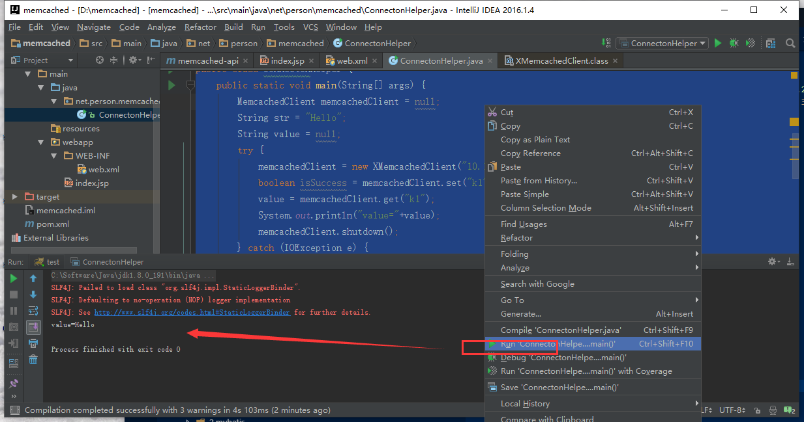

总操作流程：
- 1、[创建maven项目](#memcached-01)
- 2、[写代码](#memcached-02)
- 3、[测试](#memcached-03)

***

# <a name="memcached-01" href="#" >创建maven项目</a>

[](https://github.com/OurNotes/CCN/blob/master/06.%E5%90%8E%E5%8F%B0/01.java/03.Javaweb%E4%B9%8B%E6%95%B4%E5%90%88%E4%BE%8B%E5%AD%90/02.ssm%2Bm%2B%E6%95%B0%E6%8D%AE%E5%BA%93%E7%9A%84%E6%95%B4%E5%90%88/01.ssm%E6%95%B4%E5%90%88%E4%B9%8B%E7%94%A8maven%E5%88%9B%E5%BB%BAweb%E9%A1%B9%E7%9B%AE.md)

# <a name="memcached-02" href="#" >写代码</a>

> 配置pom.xml

<details>
<summary>代码</summary>

```xml
<project xmlns="http://maven.apache.org/POM/4.0.0" xmlns:xsi="http://www.w3.org/2001/XMLSchema-instance"
         xsi:schemaLocation="http://maven.apache.org/POM/4.0.0 http://maven.apache.org/maven-v4_0_0.xsd">
    <modelVersion>4.0.0</modelVersion>
    <groupId>com.imooc.jiangzh</groupId>
    <artifactId>memcached-api</artifactId>
    <packaging>jar</packaging>
    <version>1.0-SNAPSHOT</version>
    <name>Maven Quick Start Archetype</name>
    <url>http://maven.apache.org</url>
    <dependencies>
        <dependency>
            <groupId>com.googlecode.xmemcached</groupId>
            <artifactId>xmemcached</artifactId>
            <version>2.4.6</version>
        </dependency>
        <dependency>
            <groupId>junit</groupId>
            <artifactId>junit</artifactId>
            <version>4.12</version>
        </dependency>
    </dependencies>
</project>
```

</details>

> 创建ConnectonHelper的java文件

<details>
<summary>代码</summary>

```java
package net.person.memcached;

import net.rubyeye.xmemcached.MemcachedClient;
import net.rubyeye.xmemcached.XMemcachedClient;
import net.rubyeye.xmemcached.exception.MemcachedException;

import java.io.IOException;
import java.util.concurrent.TimeoutException;

/**
 * Created by admin on 2019/2/27.
 */
public class ConnectonHelper {
    public static void main(String[] args) {
        MemcachedClient memcachedClient = null;
        String str = "Hello";
        String value = null;
        try {
            memcachedClient = new XMemcachedClient("10.10.2.4",2222);
            boolean isSuccess = memcachedClient.set("k1", 3600, str);
            value = memcachedClient.get("k1");
            System.out.println("value="+value);
            memcachedClient.shutdown();
        } catch (IOException e) {
            e.printStackTrace();
        }catch (TimeoutException e) {
            e.printStackTrace();
        } catch (InterruptedException e) {
            e.printStackTrace();
        } catch (MemcachedException e) {
            e.printStackTrace();
        }

    }

}

```

</details>


# <a name="memcached-03" href="#" >测试</a>


