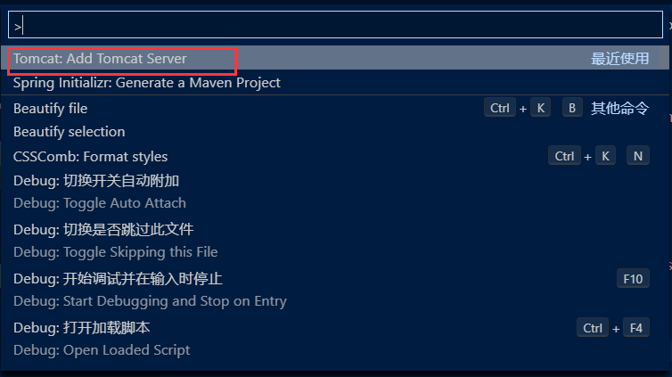

总操作流程:
- 1、下载插件
- 2、配置
- 3、测试

***

# 下载插件
- Maven for Java
- Tomcat for Java
- Spring Boot Extension Pack
- Java Extension Pack
- Language Support for Java™ by Red Hat
- Debugger for Java
- Java Test Runner
- Java Dependency Viewer
- Auto Import

# 配置

> jdk的配置
```json
"java.home": "C:\\Software\\Java\\jdk1.8.0_191",
```

> maven的配置

```json
    "java.configuration.maven.userSettings":"C:\\Software\\apache-maven-3.6.0\\conf\\settings.xml",
    "maven.executable.path": "C:\\Software\\apache-maven-3.6.0\\bin\\mvn.cmd",
    "maven.terminal.useJavaHome": true,
    "maven.terminal.customEnv": [{
        "environmentVariable": "JAVA_HOME",
        "value": "C:\\Software\\Java\\jdk1.8.0_191"
    }],
```

> 全局搜索的配置
```json
"search.exclude": {
            "**/node_modules": true,
            "**/bower_components": true,
            "**/target": true,
            "**/logs": true
        },
```

> 取消单击打开文件覆盖导航栏
```json
"workbench.editor.enablePreview": false,
```

> tomcat的配置

- 1、快捷键：Ctrl+Shift+P
- 2、选择tomcat的目录



# 测试


