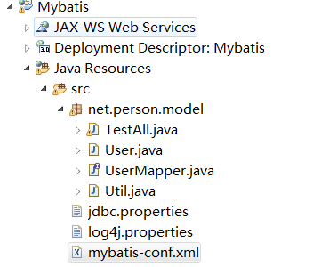

总操作流程：
- 1、[创建数据库文件jdbc.properties](#java-01)
- 2、[创建日志文件log4j.properties](#java-02)
- 3、[创建mybatis-conf.xml文件](#java-03)
- 4、[创建model层的model](#java-04)
- 5、[user的注解:UserMapper](#java-05)
- 6、[創建工具类：Util](#java-06)
- 7、[测试类:TestAll](#java-07)

----------




# <a name="java-01" href="#" >创建数据库文件jdbc.properties</a>
```
#mysql
jdbc.driver=com.mysql.jdbc.Driver
jdbc.url=jdbc:mysql://localhost:3306/mybatis
jdbc.username=root
jdbc.password=123456
```
# <a name="java-02" href="#" >创建日志文件log4j.properties</a>
```
log4j.rootLogger=CONSOLE,FILE  
log4j.addivity.org.apache=true  
  
# 应用于控制台  
log4j.appender.CONSOLE=org.apache.log4j.ConsoleAppender  
log4j.appender.CONSOLE.Threshold=INFO  
log4j.appender.CONSOLE.Target=System.out  
log4j.appender.CONSOLE.Encoding=GBK
log4j.appender.CONSOLE.layout=org.apache.log4j.PatternLayout  
log4j.appender.CONSOLE.layout.ConversionPattern=[framework] %d - %c -%-4r [%t] %-5p %c %x - %m%n  
  
# 每天新建日志  
log4j.appender.A1=org.apache.log4j.DailyRollingFileAppender  
log4j.appender.A1.File=C:/log4j/log  
log4j.appender.A1.Encoding=GBK
log4j.appender.A1.Threshold=DEBUG  
log4j.appender.A1.DatePattern='.'yyyy-MM-dd  
log4j.appender.A1.layout=org.apache.log4j.PatternLayout  
log4j.appender.A1.layout.ConversionPattern=%d{ABSOLUTE} %5p %c{1}:%L : %m%n  
  
#应用于文件  
log4j.appender.FILE=org.apache.log4j.FileAppender  
log4j.appender.FILE.File=C:/log4j/file.log  
log4j.appender.FILE.Append=false  
log4j.appender.FILE.Encoding=GBK
log4j.appender.FILE.layout=org.apache.log4j.PatternLayout  
log4j.appender.FILE.layout.ConversionPattern=[framework] %d - %c -%-4r [%t] %-5p %c %x - %m%n  
  
# 应用于文件回滚  
log4j.appender.ROLLING_FILE=org.apache.log4j.RollingFileAppender  
log4j.appender.ROLLING_FILE.Threshold=ERROR  
log4j.appender.ROLLING_FILE.File=rolling.log  
log4j.appender.ROLLING_FILE.Append=true  
log4j.appender.CONSOLE_FILE.Encoding=GBK
log4j.appender.ROLLING_FILE.MaxFileSize=10KB  
log4j.appender.ROLLING_FILE.MaxBackupIndex=1  
log4j.appender.ROLLING_FILE.layout=org.apache.log4j.PatternLayout  
log4j.appender.ROLLING_FILE.layout.ConversionPattern=[framework] %d - %c -%-4r [%t] %-5p %c %x - %m%n  
  
#自定义Appender  
log4j.appender.im = net.cybercorlin.util.logger.appender.IMAppender  
log4j.appender.im.host = mail.cybercorlin.net  
log4j.appender.im.username = username  
log4j.appender.im.password = password  
log4j.appender.im.recipient = yyflyons@163.com  
log4j.appender.im.layout=org.apache.log4j.PatternLayout  
log4j.appender.im.layout.ConversionPattern =[framework] %d - %c -%-4r [%t] %-5p %c %x - %m%n  
  
#应用于socket  
log4j.appender.SOCKET=org.apache.log4j.RollingFileAppender  
log4j.appender.SOCKET.RemoteHost=localhost  
log4j.appender.SOCKET.Port=5001  
log4j.appender.SOCKET.LocationInfo=true  
# Set up for Log Facter 5  
log4j.appender.SOCKET.layout=org.apache.log4j.PatternLayout  
log4j.appender.SOCET.layout.ConversionPattern=[start]%d{DATE}[DATE]%n%p[PRIORITY]%n%x[NDC]%n%t[THREAD]%n%c[CATEGORY]%n%m[MESSAGE]%n%n  
# Log Factor 5 Appender  
log4j.appender.LF5_APPENDER=org.apache.log4j.lf5.LF5Appender  
log4j.appender.LF5_APPENDER.MaxNumberOfRecords=2000  
  
# 发送日志给邮件  
log4j.appender.MAIL=org.apache.log4j.net.SMTPAppender  
log4j.appender.MAIL.Threshold=FATAL  
log4j.appender.MAIL.BufferSize=10  
log4j.appender.MAIL.From=yyflyons@163.com  
log4j.appender.MAIL.SMTPHost=www.wusetu.com  
log4j.appender.MAIL.Subject=Log4J Message  
log4j.appender.MAIL.To=yyflyons@126.com  
log4j.appender.MAIL.layout=org.apache.log4j.PatternLayout  
log4j.appender.MAIL.layout.ConversionPattern=[framework] %d - %c -%-4r [%t] %-5p %c %x - %m%n  
# 打印出sql
log4j.logger.java.sql.Connection=DEBUG
log4j.logger.java.sql.ResultSet=DEBUG
log4j.logger.java.sql.PreparedStatement=DEBUG
log4j.logger.java.sql.Statement=DEBUG 

```
# <a name="java-03" href="#" >创建mybatis-conf.xml文件</a>
```
<?xml version="1.0" encoding="UTF-8"?>
<!DOCTYPE configuration PUBLIC "-//mybatis.org//DTD Config 3.0//EN" "http://mybatis.org/dtd/mybatis-3-config.dtd">
<configuration>
	<!-- 链接数据库配置文件 -->
	<properties resource="jdbc.properties"></properties>
	
	<!-- 配置实体类的别名 -->
	<typeAliases>
		<typeAlias type="net.person.model.User" alias="_User"/>
	</typeAliases>
	
	 <environments default="development">
        <environment id="development">
            <transactionManager type="JDBC" />
            <dataSource type="POOLED">
                <property name="driver" value="${jdbc.driver}" />
                <property name="url" value="${jdbc.url}" />
                <property name="username" value="${jdbc.username}" />
                <property name="password" value="${jdbc.password}" />
            </dataSource>
        </environment>
    </environments>
	
	<mappers>
		<mapper class="net.person.model.UserMapper"/>
	</mappers>
	

</configuration>

```

# <a name="java-04" href="#" >创建model层的model</a>
```
package net.person.model;

public class User {
	private int id;
	private String username;
	private int age;
	
	public User(){
		
	}
	
	public User(int id, String username, int age) {
		super();
		this.id = id;
		this.username = username;
		this.age = age;
	}
	
	public int getId() {
		return id;
	}
	public void setId(int id) {
		this.id = id;
	}
	public String getUsername() {
		return username;
	}
	public void setUsername(String username) {
		this.username = username;
	}
	public int getAge() {
		return age;
	}
	public void setAge(int age) {
		this.age = age;
	}

	@Override
	public String toString() {
		return "User [id="+ id + ", username=" + username + ", age=" + age + "]";
	}

}

```
# <a name="java-05" href="#" >user的注解:UserMapper</a>
```
package net.person.model;

import java.util.List;

import org.apache.ibatis.annotations.Delete;
import org.apache.ibatis.annotations.Insert;
import org.apache.ibatis.annotations.Select;
import org.apache.ibatis.annotations.Update;

public interface UserMapper {
	@Insert("insert into users(username, age) values(#{username}, #{age})")
	public int insertUser(User user);

	@Delete("delete from users where id=#{id}")
	public int deleteUserById(int id);
			
	@Update("update users set username=#{username},age=#{age} where id=#{id}")
	public int updateUser(User user);

	@Select("select * from users where id=#{id}")
	public User getUserById(int id);

	@Select("select * from users")
	public List<User> getAllUser();

}

```
# <a name="java-06" href="#" >創建工具类：Util</a>
```
package net.person.model;

import java.io.InputStream;

import org.apache.ibatis.session.SqlSessionFactory;
import org.apache.ibatis.session.SqlSessionFactoryBuilder;

public class Util {
	public static SqlSessionFactory getFactory(){
		String resource = "mybatis-conf.xml"; 
		//加载mybatis的配置文件（它也加载关联的映射文件）
		InputStream is = Util.class.getClassLoader().getResourceAsStream(resource); 
		//构建sqlSession的工厂
		SqlSessionFactory factory = new SqlSessionFactoryBuilder().build(is);
		return factory;
	}
}

```
# <a name="java-07" href="#" >测试类:TestAll</a>
```
package net.person.model;

import java.io.InputStream;
import java.util.List;

import org.apache.ibatis.session.SqlSession;
import org.apache.ibatis.session.SqlSessionFactory;
import org.apache.ibatis.session.SqlSessionFactoryBuilder;
import org.junit.Test;

public class TestAll {
	/**
	 * 增添数据
	 */
	@Test
	public void testAdd2(){
		SqlSessionFactory factory=Util.getFactory();
		//创建能执行映射文件中sql的sqlSession
		SqlSession session = factory.openSession();
		UserMapper mapper=session.getMapper(UserMapper.class);
		int add=mapper.insertUser(new User(-1,"jjj",45));
		System.out.println(add);
		//提交
		session.commit();
		session.close();
	} 
	/**
	 * 查询数据
	 */
	@Test
	public void testSelect2(){
		SqlSessionFactory factory=Util.getFactory();
		//创建能执行映射文件中sql的sqlSession
		SqlSession session = factory.openSession();
		UserMapper mapper=session.getMapper(UserMapper.class);
		User user=mapper.getUserById(1);
		System.out.println(user);
		//提交
		session.commit();
		session.close();
	}
	/**
	 * 更新数据
	 */
	@Test
	public void testUpate2(){
		SqlSessionFactory factory=Util.getFactory();
		//默认是手动提交的
		SqlSession session = factory.openSession();
		
		UserMapper mapper=session.getMapper(UserMapper.class);
		int update=mapper.updateUser(new User(1,"k4",25));
		
		//提交
		session.commit();
		session.close();
		
		System.out.println(update);
	}
	
	/**
	 * 删除数据
	 */
	@Test
	public void testDelete2(){
		SqlSessionFactory factory=Util.getFactory();
		//默认是手动提交的
		SqlSession session = factory.openSession();
		
		UserMapper mapper=session.getMapper(UserMapper.class);
		int delete=mapper.deleteUserById(1);
		
		//提交
		session.commit();
		session.close();
		
		System.out.println(delete);
	}
	/**
	 * 查询数据列表
	 */
	@Test
	public void testUserList2(){
		SqlSessionFactory factory=Util.getFactory();
		//默认是手动提交的
		SqlSession session = factory.openSession();
		
		UserMapper mapper=session.getMapper(UserMapper.class);
		
		List<User> user=mapper.getAllUser();
		
		System.out.println(user);
		
	}

}

```
