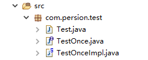
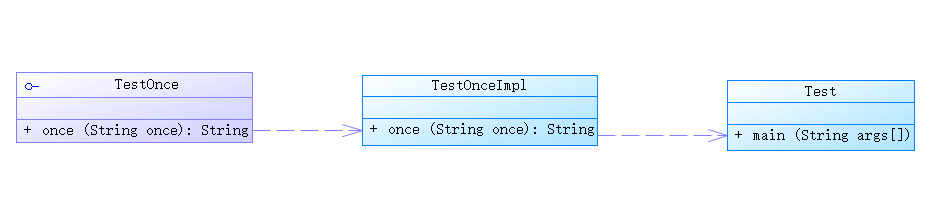

操作总流程：
- 1、[创建接口](#java-01)
- 2、[创建实现类](#java-02)
- 3、[创建主函数输出数据](#java-03)

----------

- 项目结构：



- 代码结构：



# <a name="java-01" href="#" >接口的代码</a>
```
package com.persion.test;

public interface TestOnce {
	String once(String once);
}
```
# <a name="java-02" href="#" >实现类的代码</a>
```
package com.persion.test;

public class TestOnceImpl implements TestOnce{

	@Override
	public String once(String once) {
		
		return "你好"+once;
	}

}
```
# <a name="java-03" href="#" >主函数代</a>
```
package com.persion.test;

public class Test {
	public static void main(String[] args) {
		TestOnce TO=new TestOnceImpl();
		System.out.println(TO.once("丽丽"));
	}
}
```