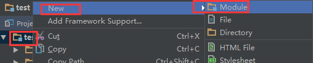
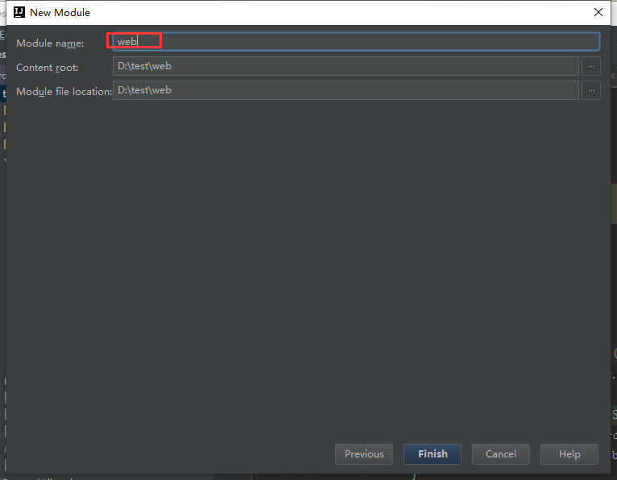
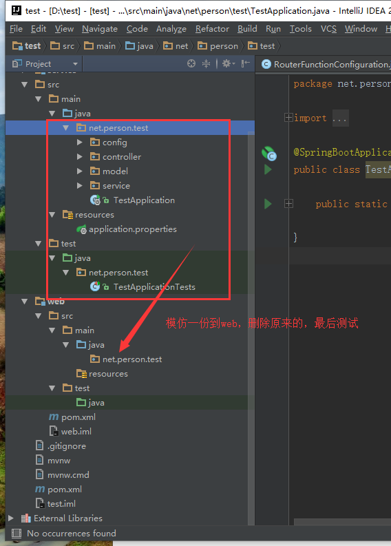
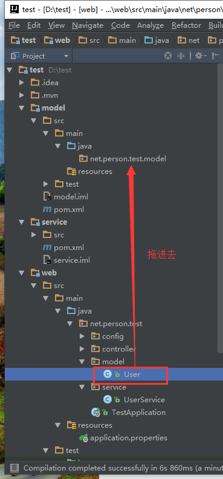
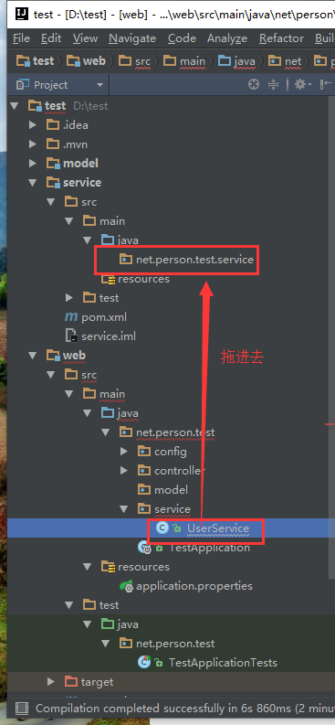
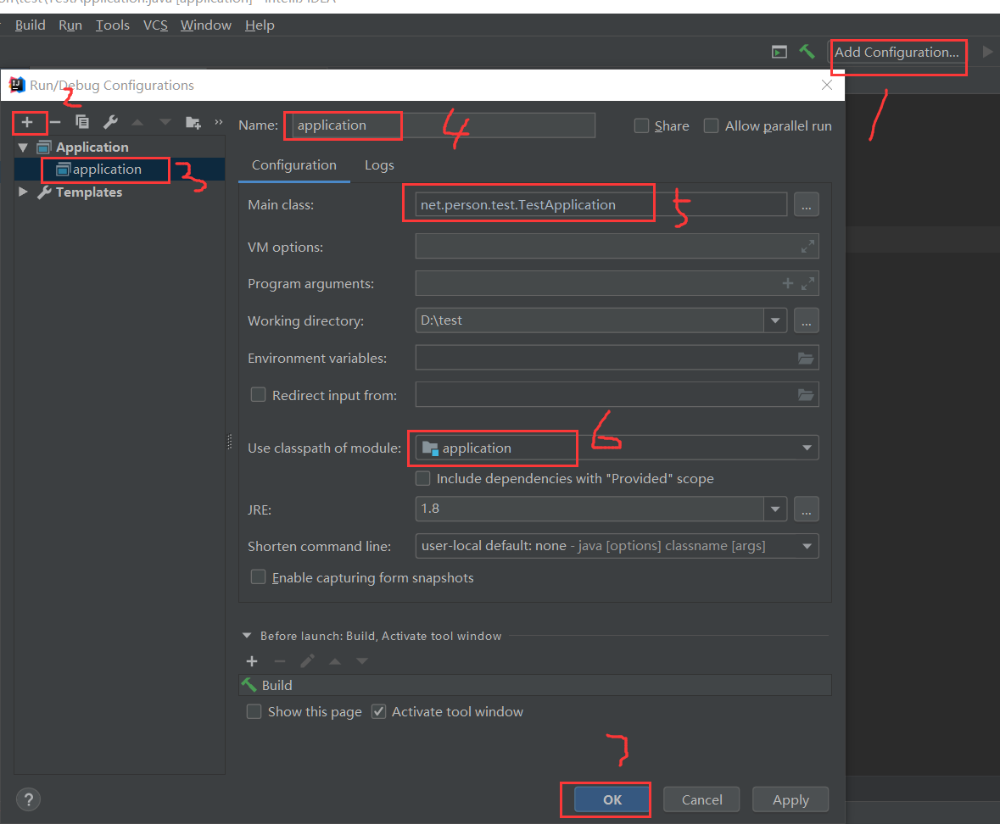

总操作流程：
- 1、[创建多模块](springBoot-01)
- 2、[迁移代码](springBoot-02)
- 3、[配置](springBoot-03)
- 4、[测试](springBoot-04)

***

# <a name="springBoot-01" href="#" >创建多模块</a>

>以创建web的模块为例子，其他创建例子一样。



- 创建模块时，Create from archetype的复选框要选择




# <a name="springBoot-02" href="#" >迁移代码</a>

> 根据模块迁移对应的代码



- 删除总的pom.xml的
```xml
    <build>
        <plugins>
            <plugin>
                <groupId>org.springframework.boot</groupId>
                <artifactId>spring-boot-maven-plugin</artifactId>
            </plugin>
        </plugins>
    </build>
```
- 在主模块的pom.xml

```xml
    <build>
        <finalName>ssm</finalName>
        <plugins>
            <plugin>
                <groupId>org.springframework.boot</groupId>
                <artifactId>spring-boot-maven-plugin</artifactId>
                <configuration>
                    <mainClass>net.person.TestApplication</mainClass>
                </configuration>
                <executions>
                    <execution>
                        <goals>
                            <goal>repackage</goal>
                        </goals>
                    </execution>
                </executions>
            </plugin>
        </plugins>
    </build>
```







# <a name="springBoot-02" href="#" >配置</a>

- 配置pom.xml

>根据各模块依赖的不同，修改各模块的pom.xml


- 配置编译
  


# <a name="springBoot-03" href="#" >测试</a>

运行代码，使用postman测试接口
