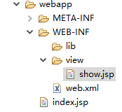

总操作流程：
- 1、[在pom.xml配置需要的架包](#java-01)
- 2、[在web.xml配置](#java-02)
- 3、[创建jsp文件和修改index.jsp文件](#java-03)
- 4、[创建struts.xml文件](#java-04)
- 5、[创建Java文件](#java-05)

[](https://github.com/lidekai/maven-structs2)

----------
# <a name="java-01" href="#" >在pom.xml配置需要的架包</a>
```xml
<project xmlns="http://maven.apache.org/POM/4.0.0" xmlns:xsi="http://www.w3.org/2001/XMLSchema-instance"
  xsi:schemaLocation="http://maven.apache.org/POM/4.0.0 http://maven.apache.org/maven-v4_0_0.xsd">
  <modelVersion>4.0.0</modelVersion>
  <groupId>com.person.test</groupId>
  <artifactId>test</artifactId>
  <packaging>war</packaging>
  <version>0.0.1-SNAPSHOT</version>
  <name>test Maven Webapp</name>
  <url>http://maven.apache.org</url>
  <!-- 
  	      版本设置 
  -->
  <properties>
  	<!-- junit -->
  	<junit.version>3.8.1</junit.version>
  	<!-- javax.servlet-api -->
  	<servlet.version>4.0.0</servlet.version>
  	<!-- struts2-core -->
  	<struts2.core.version>2.5.13</struts2.core.version>
  </properties>
  
  <!-- 
  	      导入的包
  -->
  <dependencies>
  
  
    <dependency>
      <groupId>junit</groupId>
      <artifactId>junit</artifactId>
      <version>${junit.version}</version>
      <scope>test</scope>
    </dependency>
    
    <dependency>
     	<groupId>javax.servlet</groupId>
	    <artifactId>javax.servlet-api</artifactId>
	    <version>${servlet.version}</version>
	    <scope>provided</scope>
	</dependency>
	
	<!-- ============================struts=================================== -->
	<dependency>
	    <groupId>org.apache.struts</groupId>
	    <artifactId>struts2-core</artifactId>
	    <version>${struts2.core.version}</version>
	</dependency>
    
    
  </dependencies>
  <build>
    <finalName>test</finalName>
    
  </build>
</project>

```
# <a name="java-02" href="#" >在web.xml配置</a>
```xml
<!DOCTYPE web-app PUBLIC
 "-//Sun Microsystems, Inc.//DTD Web Application 2.3//EN"
 "http://java.sun.com/dtd/web-app_2_3.dtd" >
<web-app>
  <display-name>Archetype Created Web Application</display-name>
    
    <!-- 配置Struts2框架的核心调度器 -->
    <filter>
        <filter-name>struts2</filter-name>
        <filter-class>org.apache.struts2.dispatcher.filter.StrutsPrepareAndExecuteFilter</filter-class>
    </filter>
    <filter-mapping>
        <filter-name>struts2</filter-name>
        <url-pattern>/*</url-pattern>
    </filter-mapping>
    
    <!-- 默认主界面 -->
    <welcome-file-list>
        <welcome-file>index.jsp</welcome-file>
    </welcome-file-list>
</web-app>
```
# <a name="java-03" href="#" >创建jsp文件和修改index.jsp文件</a>

### 1、创建index.jsp
```html
<%@ page contentType="text/html; charset=UTF-8" pageEncoding="UTF-8"%>

<!DOCTYPE html PUBLIC "-//W3C//DTD HTML 4.01 Transitional//EN" "http://www.w3.org/TR/html4/loose.dtd">
<html>
<body>
    <h2>第一页</h2>
    <form action="toShow">
         <input type="submit" value="提交">
    </form>
</body>
</html>
```
### 2、show.jsp
```html
<%@ page contentType="text/html; charset=UTF-8" pageEncoding="UTF-8"%>

<!DOCTYPE html PUBLIC "-//W3C//DTD HTML 4.01 Transitional//EN" "http://www.w3.org/TR/html4/loose.dtd">
<html>
<body>
    <h2>第二页</h2>
</body>
</html>
```
# <a name="java-04" href="#" >创建struts.xml文件</a>
\

```xml
<?xml version="1.0" encoding="UTF-8" ?>  
<!DOCTYPE struts PUBLIC  
    "-//Apache Software Foundation//DTD Struts Configuration 2.3//EN"  
    "http://struts.apache.org/dtds/struts-2.3.dtd"> 
<struts>
	<!--开启开发模式 -->
    <constant name="struts.devMode" value="true"></constant>
     
    <!-- 设置action的信息 -->
    <package name="default" namespace="/" extends="struts-default">
        <action name="toShow" class="com.person.controller.UserController" method="showUser">
            <result name="success">/WEB-INF/view/show.jsp</result>
        </action>
    </package>
</struts>
```
# <a name="java-05" href="#" >创建Java文件</a>


```java
package com.person.controller;

import com.opensymphony.xwork2.ActionSupport;

public class UserController extends ActionSupport{
	private static final long serialVersionUID = 1L; 
	public String showUser() {
		System.out.println("111111111");
		return SUCCESS;  
	}
}

```