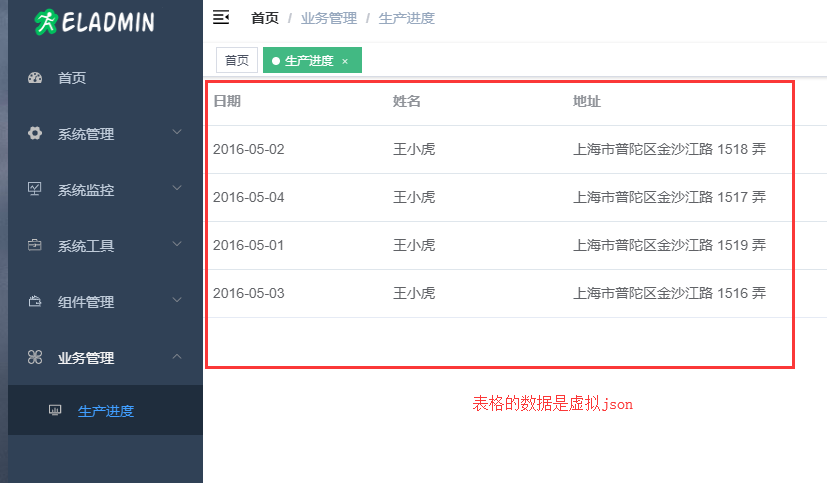
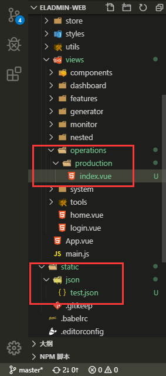

总操作流程
- 1、[看效果](#eladmin-01)
- 2、[运行代码](#eladmin-02)
- 3、[写代码](#eladmin-03)

***

# <a name="eladmin-01" href="#" >看效果</a>



# <a name="eladmin-02" href="#" >运行代码</a>

> 1、使用sts运行eladmin源码或者运行其jar

> 2、运行eladmin-web项目

```
cnpm run dev
```

# <a name="eladmin-03" href="#" >写代码</a>

- 代码结构



> 写虚拟数据json

```json
[{
    "date": "2016-05-02",
    "name": "王小虎",
    "address": "上海市普陀区金沙江路 1518 弄"
  }, {
    "date": "2016-05-04",
    "name": "王小虎",
    "address": "上海市普陀区金沙江路 1517 弄"
  }, {
    "date": "2016-05-01",
    "name": "王小虎",
    "address": "上海市普陀区金沙江路 1519 弄"
  }, {
    "date": "2016-05-03",
    "name": "王小虎",
    "address": "上海市普陀区金沙江路 1516 弄"
  }]
```

> 写页面文件index.vue

```html
<template>
  <el-table
    :data="tableData"
    style="width: 100%">
    <el-table-column
      prop="date"
      label="日期"
      width="180"/>
    <el-table-column
      prop="name"
      label="姓名"
      width="180"/>
    <el-table-column
      prop="address"
      label="地址"/>
  </el-table>
</template>

<script>
import axios from 'axios'
export default {
  data() {
    return {
      tableData: []
    }
  },
  mounted: function() {
    this.getJson()
  },
  methods: {
    getJson() {
      axios.get('/static/json/test.json')
        .then((response) => {
          this.tableData = response.data
        }).catch((response) => {
          console.log(response) // 浏览器按F12 进入调试模式，选择Console选项卡，可以看到后台输入
        })
    }
  }

}
</script>

<style scoped>
</style>

```