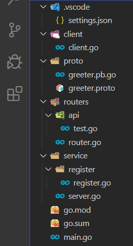

总操作流程：
- 1、[单独测试成功](#go-01)
- 2、[集成](#go-02)
- 3、[测试](#go-03)


***

# <a name="go-01" href="#" >单独测试成功</a>

> 单独测试gin

[](https://github.com/OurNotes/CCN/blob/master/6.%E5%90%8E%E5%8F%B0/4.go/01.windows%E7%8E%AF%E5%A2%83/02.go%E4%B9%8B%E6%A1%86%E6%9E%B6/01.go%E4%B9%8Bgin/01.gin%E4%B9%8B%E5%BF%AB%E9%80%9F%E5%BC%80%E5%A7%8B.md)

> 单独测试成功grpc

[-yellow.svg "参考文献 go-grpc之SimpleRPC(简单rpc)")](https://github.com/OurNotes/CCN/blob/master/6.%E5%90%8E%E5%8F%B0/4.go/01.windows%E7%8E%AF%E5%A2%83/02.go%E4%B9%8B%E6%A1%86%E6%9E%B6/02.go%E4%B9%8Bgrpc/01.go-grpc%E4%B9%8BSimple%20RPC(%E7%AE%80%E5%8D%95rpc).md)

# <a name="go-02" href="#" >集成</a>

> 项目目录




### 服务端

> greeter.proto

<details>
<summary>代码</summary>

```go
syntax = "proto3";

package proto;

service SearchService {
    rpc Search(SearchRequest) returns (SearchResponse) {}
}

message SearchRequest {
    string request = 1;
}

message SearchResponse {
    string response = 1;
}
```

</details>

- 编译

```js
# 进入proto目录下，在shell输入命令

cd proto

protoc -I . greeter.proto --go_out=plugins=grpc:.
```


> register.go

<details>
<summary>代码</summary>

```go
/*
 * @Descripttion: 服务端的接口和注册
 * @version: 0.1
 * @Author: DK_Li
 * @Date: 2020-02-10 15:23:04
 * @LastEditors  : DK_Li
 * @LastEditTime : 2020-02-11 22:10:41
 */

package register
 
import (
	"context"
	"google.golang.org/grpc"
	proto "test/proto"
 
)

type SearchService struct{}

/**
 * @description: 服务端的接口
 * @param {type} 
 * @return: 
 */
func (s *SearchService) Search(ctx context.Context, r *proto.SearchRequest) (*proto.SearchResponse, error) {
	return &proto.SearchResponse{Response: r.GetRequest() + " Server"}, nil
}

/**
 * @description: 服务端的注册
 * @param {type} 
 * @return: 
 */
func ServiceReg(server *grpc.Server)  {
	proto.RegisterSearchServiceServer(server,&SearchService{})

}
```

</details>

> server.go

<details>
<summary>代码</summary>

```go
/*
 * @Descripttion: 服务端的启动文件
 * @version: 0.1
 * @Author: DK_Li
 * @Date: 2020-02-10 14:47:35
 * @LastEditors  : DK_Li
 * @LastEditTime : 2020-02-11 22:06:59
 */

package main
 
import (
	"log"
	"net"
	"google.golang.org/grpc"
	"google.golang.org/grpc/reflection"
	service "test/service/register"
)


const PORT = "8080"

func main() {
	//创建 Listen，监听 TCP 端口
	lis, err := net.Listen("tcp", ":"+PORT)
	if err != nil {
		log.Fatalf("net.Listen err: %v", err)
	}
	//创建 gRPC Server 对象
	server := grpc.NewServer()
	//将 SearchService注册到 gRPC Server 的内部注册中心
	service.ServiceReg(server)
	// Register reflection service on gRPC server.
	reflection.Register(server)
	if err := server.Serve(lis); err != nil {
		log.Fatalf("failed to serve: %v", err)
	}
}
```

</details>


### 客户端

> client.go

<details>
<summary>代码</summary>

```go
/*
 * @Descripttion: grpc的客户端连接服务端复用方法
 * @version: 0.1
 * @Author: DK_Li
 * @Date: 2020-02-11 18:39:15
 * @LastEditors  : DK_Li
 * @LastEditTime : 2020-02-11 22:00:53
 */

package client

import (
	"google.golang.org/grpc"
	"sync"
	"sync/atomic"
	"unsafe"
	proto "test/proto"
)
 
var (
	globalClientConn unsafe.Pointer
	lck              sync.Mutex
)

/**
 * @description: 创建 SearchService 的客户端对象
 * @param {type} 
 * @return: 
 */
func GetGrpcClient(target string) (proto.SearchServiceClient, error) {  //返回需要的client
	conn, err := GetGrpcConn(target)
	if err != nil {
		return (proto.SearchServiceClient)(nil), err
	}
	return proto.NewSearchServiceClient(conn), nil  //此处调用pb.go文件中生成的创建client的方法
}


func GetGrpcConn(target string) (*grpc.ClientConn, error) {
	if atomic.LoadPointer(&globalClientConn) != nil {
		return (*grpc.ClientConn)(globalClientConn), nil
	}
	lck.Lock()
	defer lck.Unlock()
	if atomic.LoadPointer(&globalClientConn) != nil { //double check
		return (*grpc.ClientConn)(globalClientConn), nil
	}
	cli, err := NewGrpcConn(target)
	if err != nil {
		return nil, err
	}
	atomic.StorePointer(&globalClientConn, unsafe.Pointer(cli))
	return cli, nil
}

/**
 * @description: 连接服务端
 * @param {type} 
 * @return: 
 */
func NewGrpcConn(target string) (*grpc.ClientConn,error){
	conn, err := grpc.Dial(":"+target, grpc.WithInsecure())
	if err != nil {
		return nil, err
	}
	return conn, err
}

```

</details>

> router.go

<details>
<summary>代码</summary>

```go

/*
 * @Descripttion: gin的路由
 * @version: 0.1
 * @Author: DK_Li
 * @Date: 2020-02-10 16:15:52
 * @LastEditors  : DK_Li
 * @LastEditTime : 2020-02-11 22:04:48
 */

package routers
 
import (
    "github.com/gin-gonic/gin"
    . "test/routers/api"
)
 
func InitRouter() *gin.Engine {
    router := gin.Default()
 
    router.GET("/test", Test)
 
    return router
}
```

</details>


> test.go

<details>
<summary>代码</summary>

```go
/*
 * @Descripttion: gin的api
 * @version: 0.1
 * @Author: DK_Li
 * @Date: 2020-02-10 16:16:16
 * @LastEditors  : DK_Li
 * @LastEditTime : 2020-02-11 22:04:23
 */

package api

import (
	"log"
	"context"
	"net/http"
	"github.com/gin-gonic/gin"
	proto "test/proto"
	cs "test/client"
)

const PORT = "8080"

/**
 * @description: 客户端与服务端进行数据交互
 * @param {type} 
 * @return: 
 */
func Test(c *gin.Context) {
	client,err := cs.GetGrpcClient(PORT)
	if err != nil {
		log.Fatalf("client.Search err: %v", err)
	}
	resp, err := client.Search(context.Background(), &proto.SearchRequest{
		Request: "gRPC",
	})
	if err != nil {
		log.Fatalf("client.Search err: %v", err)
		c.JSON(http.StatusOK, gin.H{                                                 
            "code":    -1,
            "message": "抱歉未找到相关信息",
        })
        return
	}

	c.JSON(200, gin.H{
		"result": resp.GetResponse(),
	})
}

```

</details>

> main.go

<details>
<summary>代码</summary>

```go
/*
 * @Descripttion: 客户端的启动文件
 * @version: 0.1
 * @Author: DK_Li
 * @Date: 2020-02-10 16:17:26
 * @LastEditors  : DK_Li
 * @LastEditTime : 2020-02-11 22:07:19
 */

package main

import (
	"log"
	"test/routers"
)

const PORT = "8080"

func main() {

	
	router := routers.InitRouter()
	// 启动并监听8089端口
	if err := router.Run(":8089"); err != nil {
		log.Fatalf("could not run server: %v", err)
	}

}


```

</details>

# <a name="go-03" href="#" >测试</a>

> 先运行grpc

```
set GO111MODULE=on
set GOPROXY=https://goproxy.io

go mod init test
go mod tidy

go run service/server.go
```

> 再运行gin

```
go run main.go
```


> 最后使用postman测试接口

```
http://localhost:8089/ping
```


