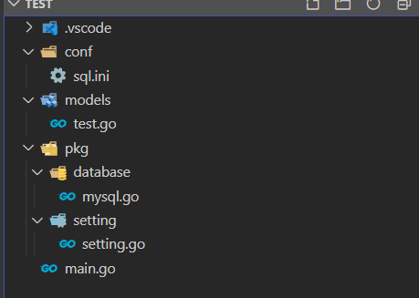

总操作流程：
- 1、[写代码](#go-01)
- 2、[测试](#go-02)

***

> 注意：本教程基于04.gorm之查询表数据

# <a name="go-01" href="#" >写代码</a>

- 项目目录



> db.ini

```ini
[database]
Type = mysql
User = gorm
Password = 123456
Host = 192.168.117.130:3306
Name = gorm
```

> setting.go

<details>
<summary>代码</summary>

```go
package setting

import (
	"log"
	"github.com/go-ini/ini"
)

type Database struct {
	Type        string
	User        string
	Password    string
	Host        string
	Name        string
}

var DatabaseSetting = &Database{}

var cfg *ini.File

func init() {
	var err error
	cfg, err = ini.Load("conf/db.ini")
	if err != nil {
		log.Fatalf("setting.Setup, fail to parse 'conf/app.ini': %v", err)
	}

	mapTo("database", DatabaseSetting)

}

func mapTo(section string, v interface{}) {
	err := cfg.Section(section).MapTo(v)
	if err != nil {
		log.Fatalf("Cfg.MapTo RedisSetting err: %v", err)
	}
}
```

</details>

> mysql.go

<details>
<summary>代码</summary>

```go
package models

import (
	"fmt"
	"log"

	"github.com/jinzhu/gorm"
	_ "github.com/jinzhu/gorm/dialects/mysql"
	"test/pkg/setting"
)


var Eloquent *gorm.DB

func init() {
	var err error

	//连接mysql
	Eloquent, err = gorm.Open(setting.DatabaseSetting.Type, fmt.Sprintf("%s:%s@tcp(%s)/%s?charset=utf8&parseTime=True&loc=Local",
		setting.DatabaseSetting.User,
		setting.DatabaseSetting.Password,
		setting.DatabaseSetting.Host,
		setting.DatabaseSetting.Name))
	if err != nil {
		log.Fatalf("mysql connect error : %v", err)
	}

	if Eloquent.Error != nil {
		log.Fatalf("database error: %v", Eloquent.Error)
	}

}


```

</details>

> test.go

<details>
<summary>代码</summary>

```go
package models

import (
	"github.com/jinzhu/gorm"
	"time"
	orm "test/pkg/database"
)

type Test struct {
	gorm.Model
	Name string 
	Age int
	Birthday time.Time
}


/**
*作用：通过年龄查询tests表的数据
*/
func GetTest(age int) (*Test, error) {
	var test Test
	err := orm.Eloquent.Where("Age =?", age).First(&test).Error
	if err != nil && err != gorm.ErrRecordNotFound {
		return nil, err
	}
	return &test, nil
}


```

</details>

> main.go

<details>
<summary>代码</summary>

```go
package main

import (
    "log"
    "fmt"
	"test/models"
	orm "test/pkg/database"
)
func main() {
  defer orm.Eloquent.Close()
  
  test,err := models.GetTest(18)
  //查询一条数据
  if err != nil {
    log.Fatalf("查询数据失败: %v",err)
    return
  }
  fmt.Println("查询数据成功")
  fmt.Println(test.Name)
}
```

</details>

# <a name="go-02" href="#" >测试</a>

> 运行项目

```shell

set GO111MODULE=on
set GOPROXY=https://goproxy.io

go mod init test
go mod tidy

go run main.go
```

- 成功标志

```shell
# 输出
查询数据成功
小猪
```