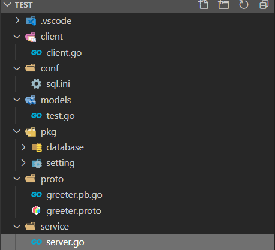

总操作流程：
- 1、[写代码](#go-01)
- 2、[测试](#go-02)

***

> 注意：本教程基于03.go之gorm+go-ini+grpc

# <a name="go-01" href="#" >写代码</a>

- 项目目录



> greeter.proto

<details>
<summary>代码</summary>

```js

syntax = "proto3";

package proto;

service SearchService {
    rpc Search(SearchRequest) returns (SearchResponse) {}
}

message SearchRequest {
    string request = 1;
}

message SearchResponse {
    string response = 1;
}
```

</details>

- 编译greeter.proto

```js
# 进入proto目录下，在shell输入命令

cd proto

protoc -I . greeter.proto --go_out=plugins=grpc:.
```

> server.go

<details>
<summary>代码</summary>

```go
package main
 
import (
	"log"
	"context"
	"net"
	"google.golang.org/grpc"
	"test/models"
	proto "test/proto"
	orm "test/pkg/database"
	
 
)

type SearchService struct{}

func (s *SearchService) Search(ctx context.Context, r *proto.SearchRequest) (*proto.SearchResponse, error) {
	defer orm.Eloquent.Close()
	test,err := models.GetTest(18)
	//查询一条数据
	if err != nil {
		log.Fatalf("查询数据失败: %v",err)
	}
	return &proto.SearchResponse{Response: r.GetRequest() + test.Name}, nil
}

const PORT = "9001"

func main() {
	//创建 Listen，监听 TCP 端口
	lis, err := net.Listen("tcp", ":"+PORT)
	if err != nil {
		log.Fatalf("net.Listen err: %v", err)
	}
	//创建 gRPC Server 对象
	server := grpc.NewServer()
	//将 SearchService注册到 gRPC Server 的内部注册中心
	proto.RegisterSearchServiceServer(server, &SearchService{})
	//gRPC Server 开始 lis.Accept，直到 Stop 或 GracefulStop
	server.Serve(lis)
}
```

</details>

> client.go

<details>
<summary>代码</summary>

```go
package main
 
import (
	"context"
	"log"

	"google.golang.org/grpc"
	proto "test/proto"
)
 
const PORT = "9001"

func main() {
	//创建与给定目标（服务端）的连接交互
	conn, err := grpc.Dial(":"+PORT, grpc.WithInsecure())
	if err != nil {
		log.Fatalf("grpc.Dial err: %v", err)
	}
	defer conn.Close()

	//创建 SearchService 的客户端对象
	client := proto.NewSearchServiceClient(conn)
	//发送 RPC 请求，等待同步响应，得到回调后返回响应结果
	resp, err := client.Search(context.Background(), &proto.SearchRequest{
		Request: "gRPC",
	})
	if err != nil {
		log.Fatalf("client.Search err: %v", err)
	}
	//输出响应结果
	log.Printf("resp: %s", resp.GetResponse())
}
```

</details>

> 其他代码和02.go之gorm+go-ini的一样

# <a name="go-02" href="#" >测试</a>

> 下载依赖

```shell

set GO111MODULE=on
set GOPROXY=https://goproxy.io

go mod init test
go mod tidy

```

> 运行服务端

```
go run service/server.go
```

> 运行客户端

```
go run client/client.go
```
- 成功标志

```shell
# 输出
gRPC小猪
```