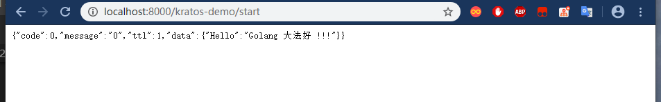

总擦流程：
- 1、[创建](#go-01)
- 2、[修改代码](#go-02)
- 3、[测试](#go-03)

***

# <a name="go-01" href="#" >创建</a>

```shell
set GO111MODULE=on
set GOPROXY=https://goproxy.io

kratos new kratos-demo
```

# <a name="go-02" href="#" >修改代码</a>

> 修改configs下的grpc.toml和http.toml的ip

```
将：0.0.0.0改成localhost
```

# <a name="go-03" href="#" >测试</a>

> 运行

```
cd kratos-demo
kratos run
```

> 测试

- 浏览器输入地址：http://localhost:8000/kratos-demo/start


