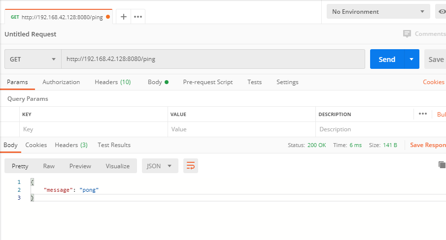

总操作流程：
- 1、[go项目打包](#go-01)
- 2、[配置](#go-02)
- 3、[测试](#go-03)

***

# <a name="go-01" href="#" >go项目打包</a>

- 打包[gin之快速开始](https://github.com/OurNotes/CCN/blob/master/06.%E5%90%8E%E5%8F%B0/04.go/02.go%E4%B9%8B%E6%A1%86%E6%9E%B6/01.go%E4%B9%8Bweb%E6%A1%86%E6%9E%B6%EF%BC%9Agin/01.gin%E4%B9%8B%E5%BF%AB%E9%80%9F%E5%BC%80%E5%A7%8B.md)这个项目

```shell
# vs code终端输入命令
set GOOS=linux
set GOARCH=amd64
go build -o "test"
```

- 将生成的文件上传linux

```shell
mkdir /usr/local/go
chmod 777 /usr/local/go

# 将项目上传到这文件夹
cd /usr/local/go

chmod 777 test
```

# <a name="go-02" href="#" >配置</a>

> 2、开放防火墙端口
```
firewall-cmd --permanent --zone=public --add-port=8080/tcp
firewall-cmd --reload
firewall-cmd --zone=public --query-port=8080/tcp
```

# <a name="go-03" href="#" >测试</a>

> 后台运行程序

```shell
nohup ./test >log.txt 
```

> 使用postman测试接口：http://192.168.42.128:8080/ping


