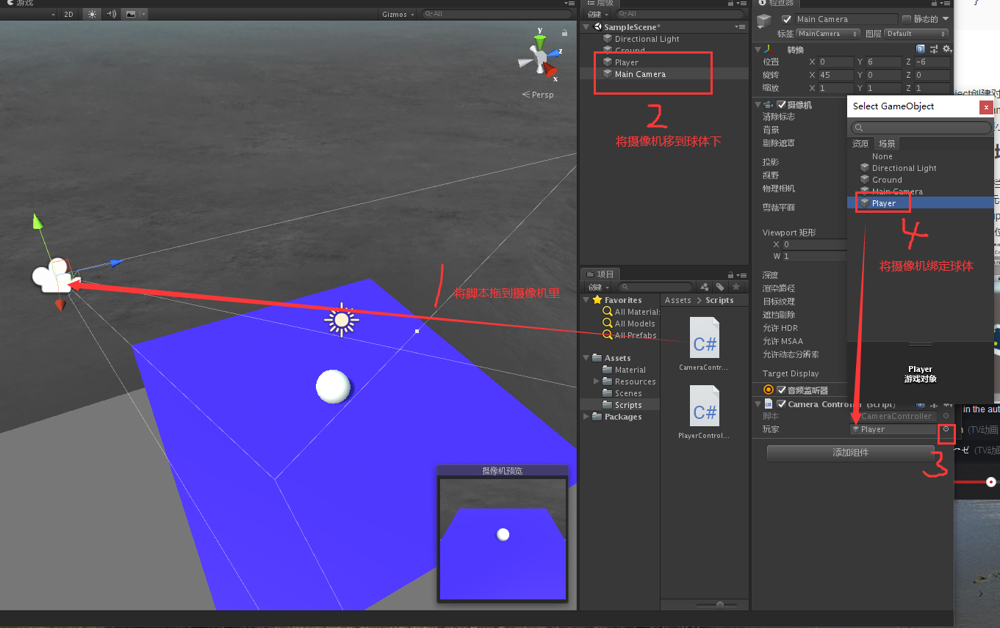
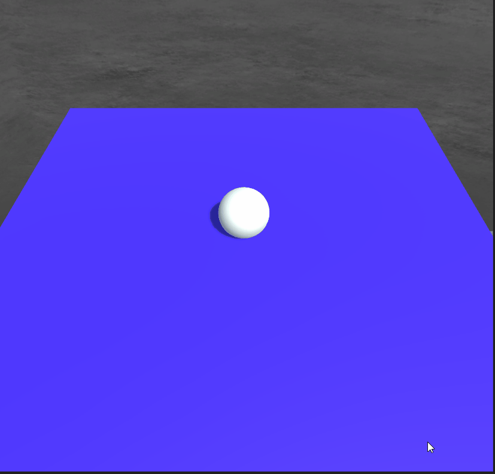

总操作流程：
- 1、[写代码](#unity-01)
- 2、[摄像机绑定球](#unity-02)
- 3、[看效果](#unity-03)

***

# <a name="unity-01" href="#" >写代码</a>

> 在Scripts文件下创建c#脚本，命名：CameraController

```java
using System.Collections;
using System.Collections.Generic;
using UnityEngine;

public class CameraController : MonoBehaviour
{
    public GameObject player;

    private Vector3 offset;

    void Start ()
    {
        offset = transform.position - player.transform.position;
    }
    
    void LateUpdate ()
    {
        transform.position = player.transform.position + offset;
    }
}

```


# <a name="unity-02" href="#" >摄像机绑定球</a>



# <a name="unity-03" href="#" >看效果</a>




