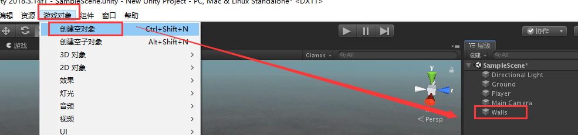
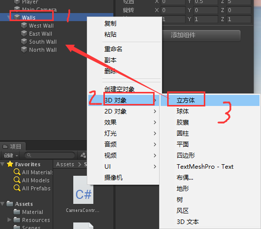
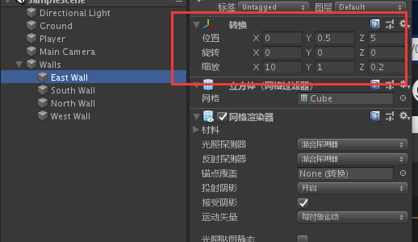
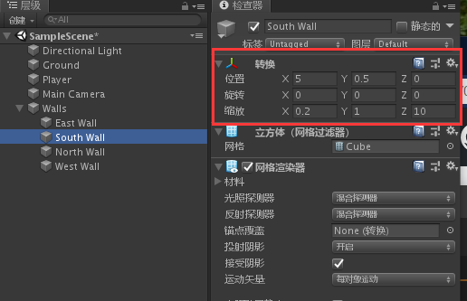
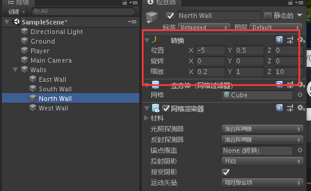
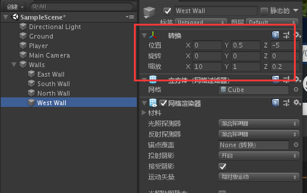
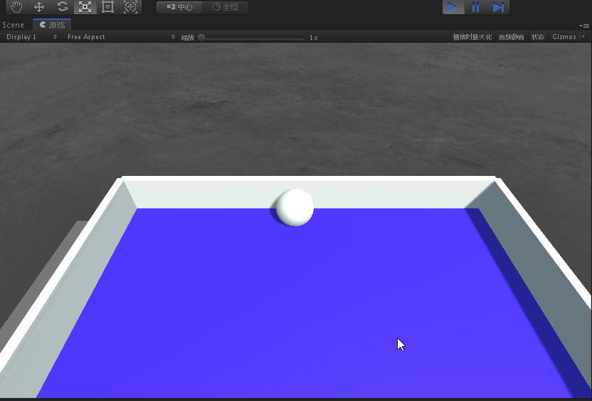

总操作流程：
- 1、[创建对象](#unity-01)
- 2、[设置](#unity-02)
- 3、[看效果](#unity-03)

***

# <a name="unity-01" href="#" >创建对象</a>

> 创建空对象

- 创建空对象，并且命名：Walls

> 创建立方体

- 在Walls下创建4个立方体，并且分别命名为：East Wall、South Wall、North Wall、West Wall

# <a name="unity-02" href="#" >设置</a>

> East Wall

> South Wall

> North Wall

> West Wall

# <a name="unity-03" href="#" >看效果</a>

