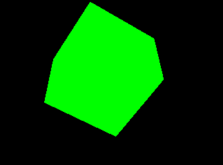
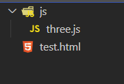

总操作流程
- 1、下载
- 2、写代码

***

# 下载

[](https://threejs.org/build/three.js)

> 下载后放到js文件夹下

# 写代码

- 效果



- 项目目录



***

<details>
<summary>代码</summary>

```html
<!--
 * @Descripttion: 
 * @version: 0.1
 * @Author: DK_Li
 * @Date: 2020-03-24 08:23:07
 * @LastEditors: DK_Li
 * @LastEditTime: 2020-03-24 08:38:37
 -->
<!DOCTYPE html>
<html>

<head>
    <meta charset="utf-8">
    <title>My first three.js app</title>
    <style>
        body {
            margin: 0;
        }

        canvas {
            display: block;
        }
    </style>
</head>

<body>
    <script src="js/three.js"></script>
    <script>
        var scene = new THREE.Scene();
        var camera = new THREE.PerspectiveCamera(75, window.innerWidth / window.innerHeight, 0.1, 1000);

        var renderer = new THREE.WebGLRenderer();
        renderer.setSize(window.innerWidth, window.innerHeight);
        document.body.appendChild(renderer.domElement);
        var geometry = new THREE.BoxGeometry();
        var material = new THREE.MeshBasicMaterial({
            color: 0x00ff00
        });
        var cube = new THREE.Mesh(geometry, material);
        scene.add(cube);

        camera.position.z = 5;

        function animate() {
            requestAnimationFrame(animate);
            cube.rotation.x += 0.01;
            cube.rotation.y += 0.01;
            renderer.render(scene, camera);
        }
        animate();
    </script>
</body>

</html>
```

</details>


