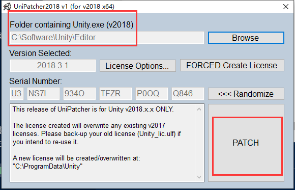
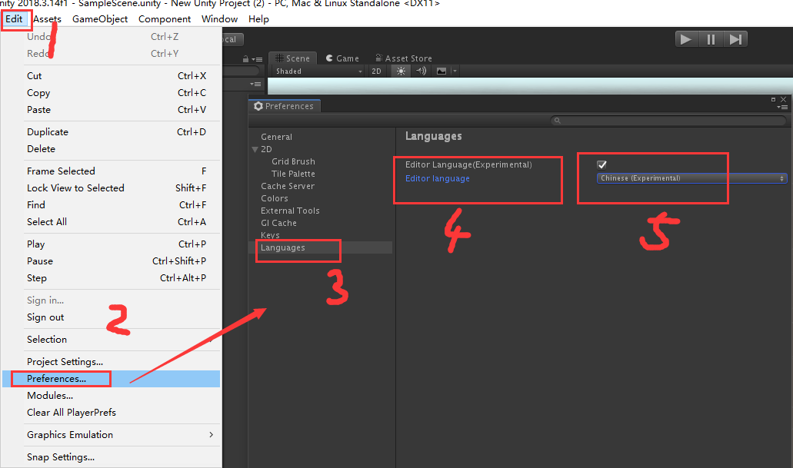

总操作流程：
 - 1、[下载安装](#unity-01)
 - 2、[配置](#unity-02)
 - 3、[看效果](#unity-03)

 ***

# <a name="unity-01" href="#" >下载安装</a>

# <a name="unity-02" href="#" >配置</a>

> 破解

- 以管理员身份运行 UniPatcher2018_v1.exe

> 中文化

- zh-cn.po放入Editor\Data\Localization文件夹下

# <a name="unity-03" href="#" >看效果</a>