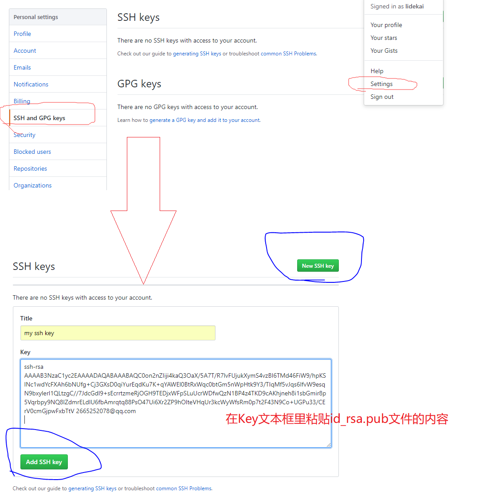

操作总流程：
- 1、[命令创建SSH Key](#git-01)
- 2、[登陆GitHub设置](#git-02)

----------

# <a name="git-01" href="#" >命令创建SSH Key</a>
- 语法：
```
ssh-keygen -t rsa -C "github注册的邮箱"
```

- 效果展现：


`注：id_rsa和id_rsa.pub两个文件，这两个就是SSH Key的秘钥对，id_rsa是私钥，不能泄露出去，id_rsa.pub是公钥，可以放心地告诉任何人。`

# <a name="git-02" href="#" >登陆GitHub设置</a>
- 操作流程：


