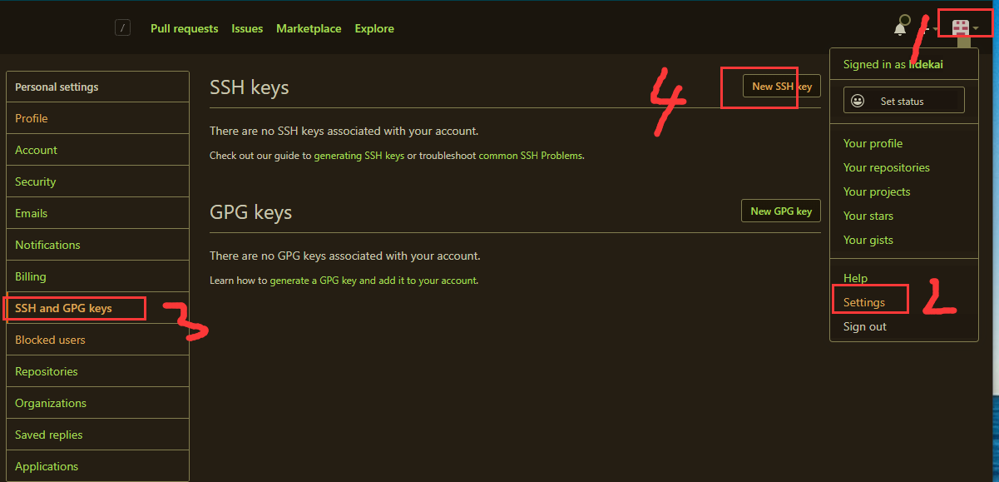

操作总流程：
- 1、命令创建SSH Key
- 2、登陆GitHub设置

----------

# 命令创建SSH Key
- 语法：
```
ssh-keygen -t rsa -C "github注册的邮箱"
```

- 效果展现：


`注：id_rsa和id_rsa.pub两个文件，这两个就是SSH Key的秘钥对，id_rsa是私钥，不能泄露出去，id_rsa.pub是公钥，可以放心地告诉任何人。`

# 登陆GitHub设置
- 操作流程：


