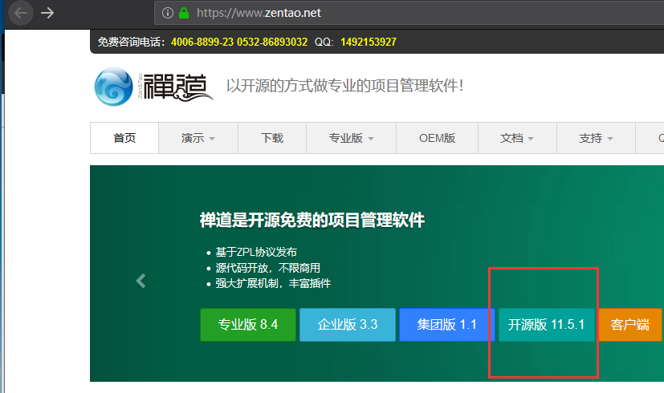
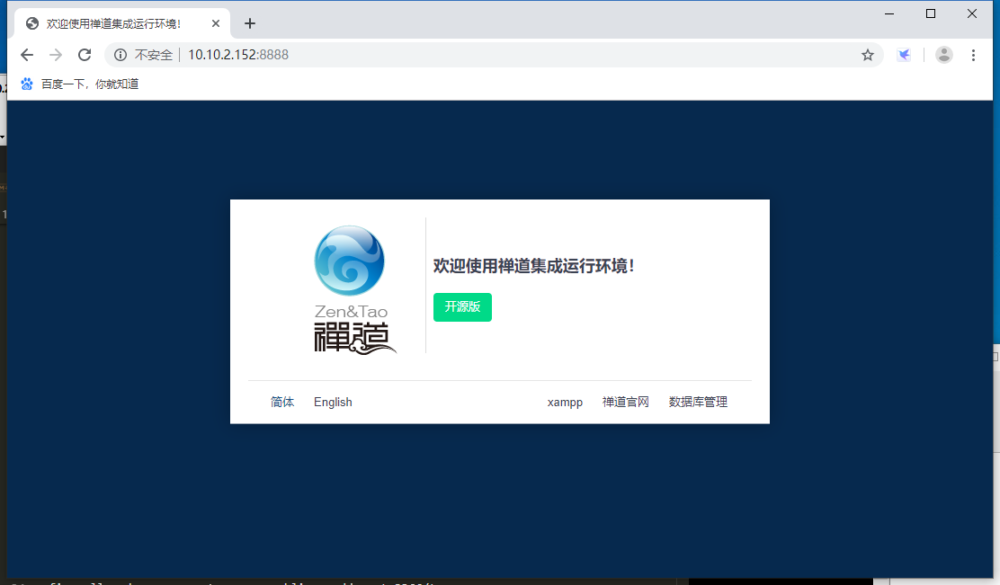
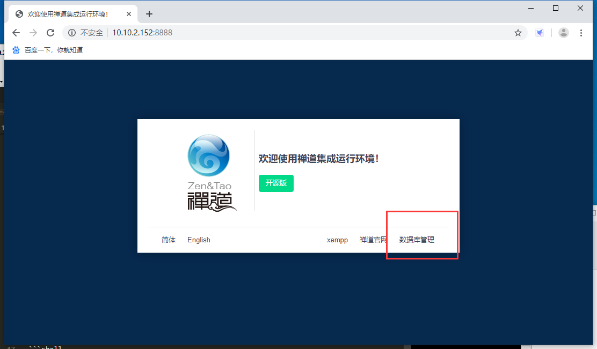
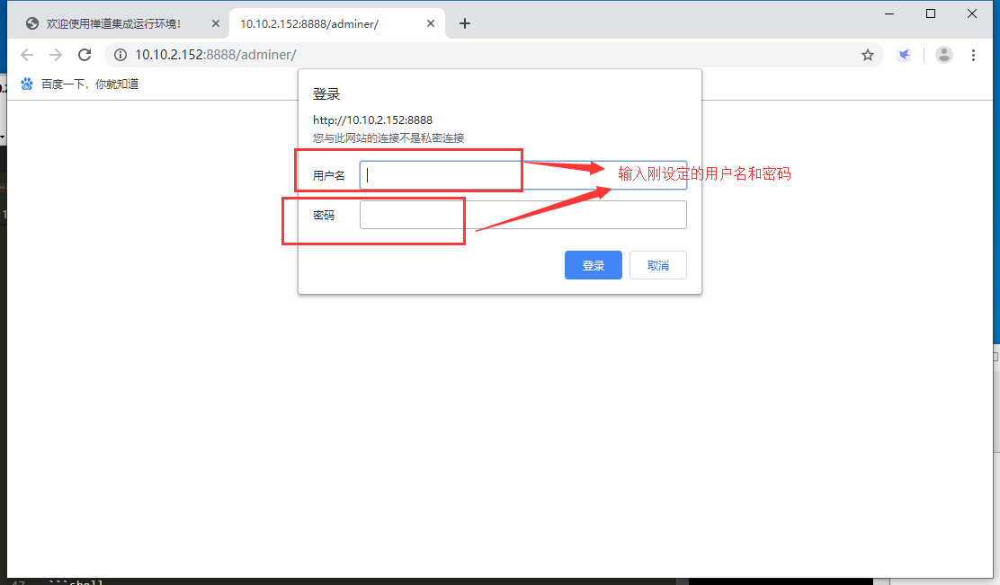
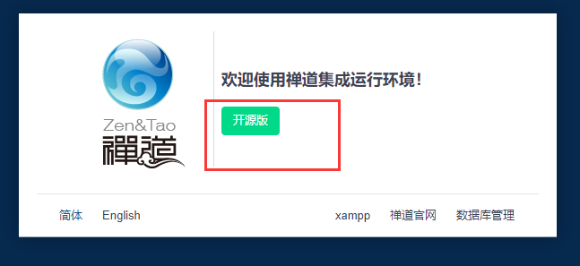
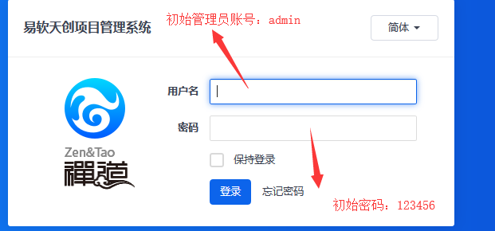

总操作流程：
- 1、下载开源linux版本的
- 2、部署
- 3、测试

***

# 下载开源linux版本的

[](https://www.zentao.net/)



# 部署

> 1、解压

```shell
#一定进入该路径
cd /opt 

#解压
tar -zxvf ZenTaoPMS*  
```

> 2、改自带的tomcat和mysql端口

```shell
#该端口
/opt/zbox/zbox -ap 8888 -mp 3366 

#centos7 的对端口进行防火墙开放
firewall-cmd --permanent --zone=public --add-port=8888/tcp
firewall-cmd --permanent --zone=public --add-port=3366/tcp
firewall-cmd --reload

# 开启禅道
/opt/zbox/zbox start 

#关闭的命令
/opt/zbox/zbox stop

``` 

- 测试成功标志：浏览器输入地址后（http://部署服务器ip地址:8888）能进入首页



> 3、创建数据的用户

```shell
cd /opt/zbox/auth/ 

# 输入这个命令后可以进行用户名和密码设定
./adduser.sh
```
- 测试成功标志






# 测试



