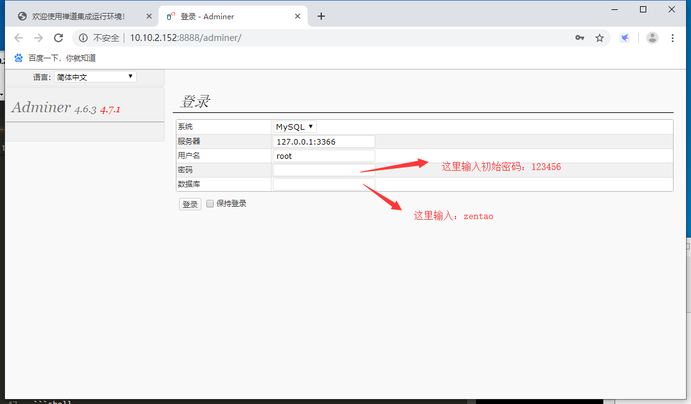
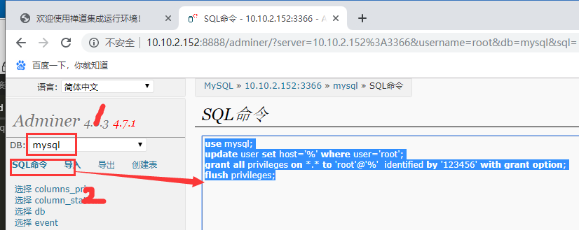
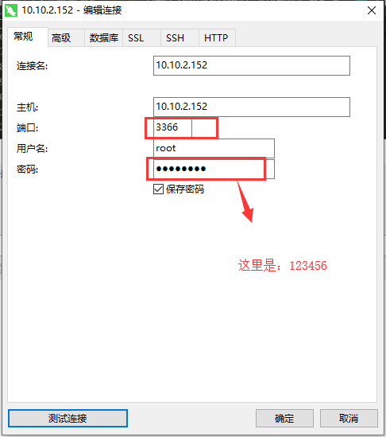

总操作流程：
- 1、使用网页方式登录数据库
- 2、写sql
- 3、改配置
- 4、测试

***

# 使用网页方式登录数据库



# 写sql

```sql
use mysql;
update user set host='%' where user='root';
grant all privileges on *.* to 'root'@'%'  identified by '123456' with grant option;
flush privileges;
```



# 改配置

```shell
vim  /opt/zbox/etc/mysql/my.cnf
```
> 在bind-address=127.0.0.1行前加#注释

# 测试

